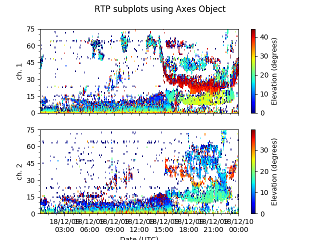

<<<<<<< HEAD
# pyDARN
[](https://www.gnu.org/licenses/gpl-3.0) [](https://www.python.org/downloads/release/python-360/) [](http://badge.fury.io/gh/boennemann%2Fbadges)

SuperDARN data visualization library. 

## Getting Started 

The following instructions will allow you to install and give some examples on how to use pydarn. 

### Prerequisites

**python 3.6+**

| Ubuntu      | OpenSuse       | Fedora        |
| ----------- | -------------- | ------------- |
| libyaml-dev | python3-PyYAML | libyaml-devel |

You can check your python version with  
`$ python --version` or 
`$ python3 --version`
### Installing 

1. Clone git repository:   
   `git clone https://github.com/SuperDARN/pydarn.git`

2. Installing pydarn  
    1. **Recommended**: Installing a [virtual environment](https://packaging.python.org/guides/installing-using-pip-and-virtualenv/), this option allows the library to install needed version of libraries without affecting system libraries.  
        * First install the environment:  
      `$ python3 -m pip install --user virtualenv`  
      `$ python3 -m virtualenv <environment name>`  
		  `$ source <environment name>/bin/activate`
        * Navigate to where you cloned pydarn:  
		  `$ python3 setup.py install`
    2. Install in the system (root privileges required):  
		   `$ sudo python3 setup.py install`

### Examples

#### Reading DMAP file 
The following example shows how to read in a FITACF file, one of the SuperDARN's DMAP file types. 

```python
import pydarn
import bz2

#read in FITACF file that is compressed with bzip2
fitacf_file = "20170514.C0.rkn.fitacf.bz2"
with bz2.open(fitacf_file) as fp:
        fitacf_stream = fp.read()
	
# Reading in the compression stream
dmap = pydarn.DarnRead(fitacf_stream, True)
fitacf_dmap = dmap.read_fitacf()

#convert to a dictionary
fitacf_data = pydarn.dmap2dict(fitacf_dmap)

#Do some parsing of the data!
elv_list = []
for fitacf_rec in fitacf_data:
    if fitacf_rec['bmnum'] == 5:
        elv_list.append(fitacf_rec['elv'])

print(elv_list[100])
```

#### Generate Range-time Parameter Plot

##### Using matplotlib pyplot

```python
import pydarn
import matplotlib.pyplot as plt

fitacf_file = "./20181209.C0.sas.fitacf"
darn_read = pydarn.DarnRead(fitacf_file)
fitacf_data = darn_read.read_fitacf()

plt.subplot(4, 1, 1)
plt.title("Summary style plot")
pydarn.RTP.plot_range_time(fitacf_data, parameter='elevation',
                           beam_num=7, date_fmt='')
plt.subplot(4, 1, 2)
pydarn.RTP.plot_range_time(fitacf_data, parameter='power',
                           beam_num=7, date_fmt='')

plt.subplot(4, 1, 3)
pydarn.RTP.plot_range_time(fitacf_data, parameter='velocity',
                           beam_num=7, color_map='jet_r',
                           date_fmt='')

plt.subplot(4, 1, 4)
pydarn.RTP.plot_range_time(fitacf_data,
                           parameter='spectral width',
                           beam_num=7)

plt.show()
```


##### Using matplotlib axes object

```python
import pydarn
import matplotlib.pyplot as plt

fitacf_file = "./20181209.C0.sas.fitacf"
darn_read = pydarn.DarnRead(fitacf_file)
fitacf_data = darn_read.read_fitacf()

fig, (ax1, ax2) = plt.subplots(2, 1)
pydarn.RTP.plot_range_time(fitacf_data, parameter='elevation',
                           beam_num=7, ax=ax1, channel=1,
                           date_fmt='')
ax1.set_ylabel("ch. 1")

pydarn.RTP.plot_range_time(fitacf_data, parameter='elevation',
                           beam_num=7, ax=ax2,
                           channel=2)
ax2.set_xlabel("Date (UTC)")
ax2.set_ylabel("ch. 2")

fig.suptitle("RTP subplots using Axes Object")
plt.show()
```


#### Turn on debugging 

```python
import pydarn
import logging

pydarn_logger = logging.getLogger('pydarn').setLevel(logging.DEBUG)

dmap_file = "./20180410.C0.sas.fitacf"
damp_reader = pydarn.DmapRead(dmap_file)
dmap_data = dmap_reader.read_records() 

print(dmap_data[0]['origin.time'].value) 
```
Run the code and two log files will be produced:
  * pydarn.log - DEBUG level info 
  * pydarn_error.log - ERROR level info

### Release History 

  * 0.0.1 
    * Add: dmap DmapRead DmapWrite implemented.
    * Add: superdarn DarnRead DarnWrite implemented
    * Add: utils for converting dmap2dict and dict2dmap
=======
# pydarn

Data Visuallization python library for SuperDARN data. 

> Warning: pyDARN currently has not been official released; however, you can use the `develop` branch to use and help test pyDARN


Steps to Installing: 

1. `git clone https://github.com/superdarn/pydarn`
2. `cd pydarn`
3. `git checkout develop`
4. Change to `develop` branch on GitHub page and follow README steps. 
>>>>>>> origin
