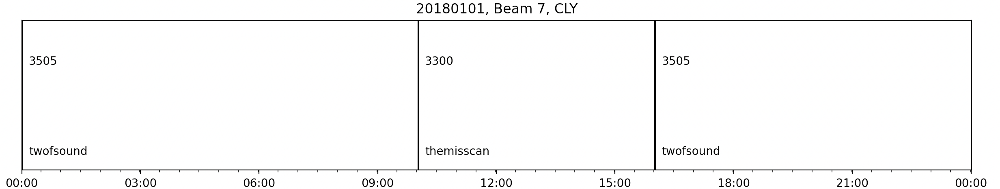

### Auto-Correlated Function  Plots

`plot_acfs` simply plots Auto-Correlated Function (ACF) of the imaginary and real parts in the loaded in RAWACF file. 

Basic code to plot ACFs from a RAWACF file would look like:
```python
import matplotlib.pyplot as plt
import pydarn

file = "20190831."
sdarn_read = pydarn.SuperDARNRead(file)
rawacf_data = sdarn_read.read_rawacf()
 
pydarn.ACF.plot_acfs(rawacf_data)
plt.show()
```  


You also have access to numerous plotting options:


| Parameter              | Action                                                                          |
| ---------------------- | ------------------------------------------------------------------------------- |
| beam_bum=0             | beam number to plot                                                             |
| gate_num=0             | gate number to plot                                                             |
| parameter='acfd'       | parameter to pick between acfd or xcfd plotting                                 |
| scan_nun=0             | the scan number to plot                                                         |
| start_time=None        | plot the closest beam scan at the start time (overrides the scan number if set) |
| ax                     | matplotlib axes object                                                          |
| normalized=True        | normalizes the parameter data with the associated power 0 value                 |
| real_color='red'       | Real part of the parameter line color                                           |
| imaginary_color='blue' | Imaginary part of the parameter line color                                      |
| plot_blank=False       | Determine if blanked lags should be plotted                                     |
| blank_marker='o'       | the marker to indicate blanked lags are a dot                                   |
| legend=True            | plot a legend                                                                   |
| kwargs                 | arguments passed in matplotlib line_plot for real and imaginary plots           |


For example, to plot blanked lags:

```python
pydarn.ACF.plot_acfs(rawacf_data, parameter='cp', date_fmt=('%H:%M'), beam_no=7)
plt.show()
```    

