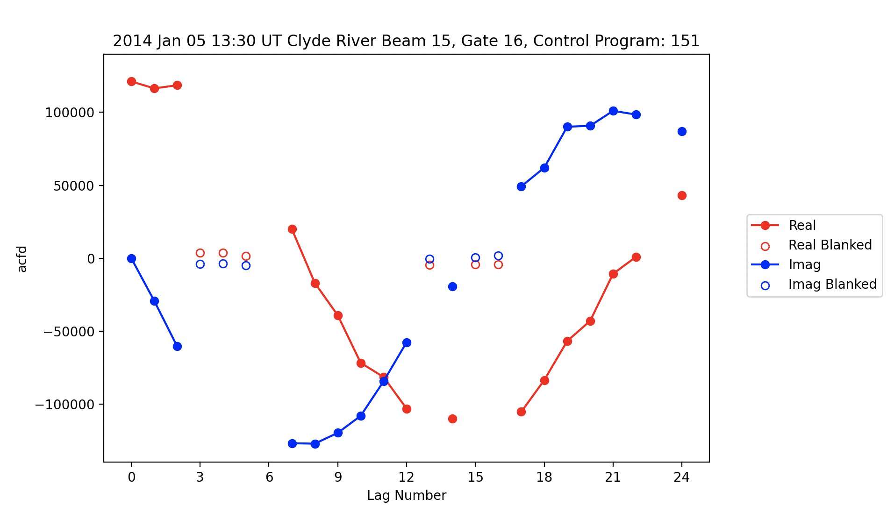

<!--Copyright (C) SuperDARN Canada, University of Saskatchewan 
Author(s): Marina Schmidt 
Modifications:

Disclaimer:
pyDARN is under the LGPL v3 license found in the root directory LICENSE.md 
Everyone is permitted to copy and distribute verbatim copies of this license 
document, but changing it is not allowed.

This version of the GNU Lesser General Public License incorporates the terms
and conditions of version 3 of the GNU General Public License, supplemented by
the additional permissions listed below.
-->

### Auto-Correlation Function Plots

`plot_acfs` plots the imaginary and real parts of the Auto-Correlation Function (ACF), along with the power and phase of the ACF in the selected RAWACF file. 

Basic code to plot ACFs from a RAWACF file would look like:
```python
import pydarn
import matplotlib.pyplot as plt 
from datetime import datetime

reader = pydarn.SuperDARNRead("data/20140105.1208.03.rkn.rawacf")
rawacf_data = reader.read_rawacf()
plt.figure(figsize=(12, 7))
pydarn.ACF.plot_acfs(rawacf_data, beam_num=7, gate_num=44,
                start_time=datetime(2014, 1, 5, 12, 8))
plt.show()
```  


You also have access to numerous plotting options:


| Parameter              | Action                                                                          |
| ---------------------- | ------------------------------------------------------------------------------- |
| beam_num=(int)             | beam number to plot                                                             |
| gate_num=(int)             | gate number to plot                                                             |
| parameter=(string)       | parameter to pick between acfd or xcfd plotting                                 |
| scan_num=(int)             | the scan number to plot                                                         |
| start_time=None        | plot the closest beam scan to the given start time (overrides the scan number if set) |
| normalized=(bool)      | normalizes the parameter data with the associated power 0 value                 |
| real_color=(str)       | Real part of the parameter line color                                           |
| imaginary_color=(str)  | Imaginary part of the parameter line color                                      |
| plot_blank=(bool)        | Determine if blanked lags should be plotted                                     |
| blank_marker=(str)       | Choice of marker to indicate blanked lags are a dot (general python markers accepted)             |
| legend=(bool)          | plot a legend                                                                   |
| pwr_and_phs=(bool)     | Plots subplots of power and phase of the ACF                                    |
| kwargs**               | arguments passed in matplotlib line_plot for real and imaginary plots           |


If blank lags are present in the data, it will look similar to the following: 

```python
import pydarn
import matplotlib.pyplot as plt 
from datetime import datetime

rawacf_file = '20140105.1200.03.cly.rawacf'
rawacf_data = pydarn.SuperDARNRead(rawacf_file).read_rawacf()
pydarn.ACF.plot_acfs(rawacf_data, beam_num=15, gate_num=16, start_time=datetime(2014, 1, 5, 13, 30), pwr_and_phs=False)
plt.show()
```    


