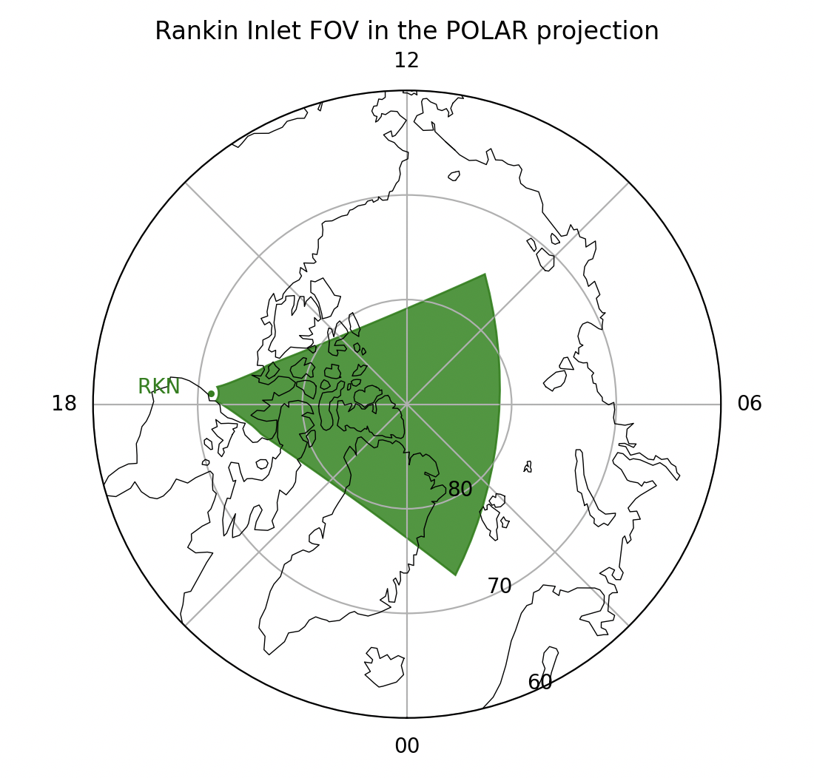
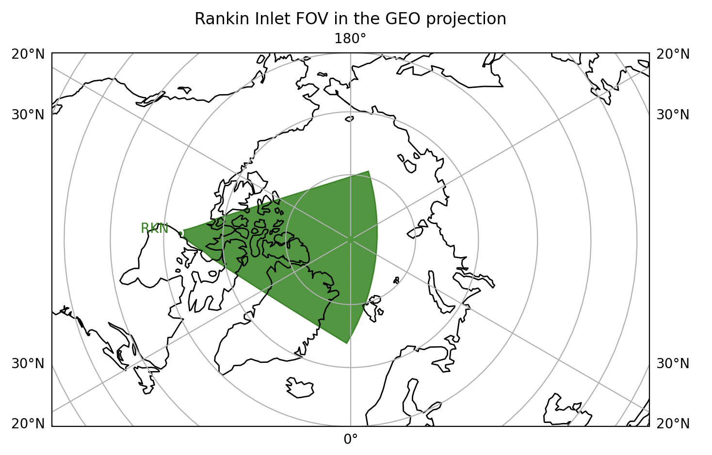
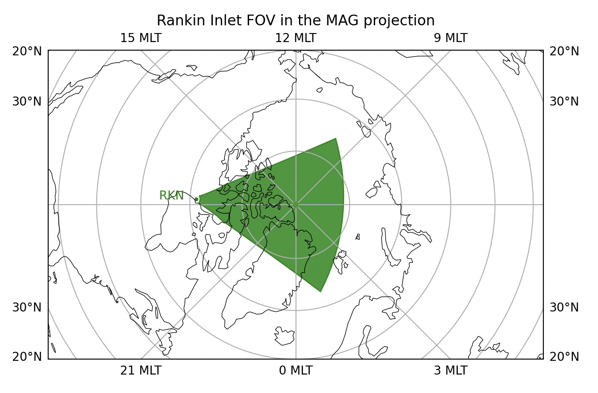

# Axes Setup 

For some spatial plots (FOV, Fan, Grid), pyDARN allows users to choose between polar, 
geographic, and geomagnetic axes using the `projs` keyword and `Projs` module.
Convection maps currently only use the polar projection.
Remember to also set the correct coordinate system for your projection, see [Ranges, Coords and Projs](https://pydarn.readthedocs.io/en/main/user/coordinates/).

## Projs.POLAR 

| Option                         | Action                                                                               |
| ------------------------------ | ------------------------------------------------------------------------------------ |
| lowlat=(int)                   | Lower Latitude boundary for the polar plot (degree) (default: 30)                    |
| hemisphere=(pydarn.Hemisphere) | Hemisphere of the radar (default: Hemisphere.North)                                  |
| coastline=(bool)               | Uses Cartopy to add outlines to the coastlines                                       |
| coastline_color=(str)          | Uses Cartopy to colour outlines to the coastlines (default: black)                   |
| cartopy_scale=(str)          | Uses Cartopy to set the resolution of the coastlines (options: '110m', '50m', '10m') |
| coastline_linewidth=(float)    | Uses Cartopy to set line width of the coastlines                                     |
| nightshade=(int)               | Uses the value given to calculate and show where on the plot the Earth is in shadow  |


This choice will return an `ax` object and a value of None for the Cartopy `ccrs` (coordinate reference system).
The polar projection allows for a lowlat keyword to plot the lowest latitude, but the center of the plot is fixed to the geomagnetic pole, if you would like to zoom in on a specific area, use the other two projections.

```python
import pydarn
import datetime as dt
import matplotlib.pyplot as plt

pydarn.Fan.plot_fov(stid=65, date=dt.datetime(2024,7,23,0,0),
                    radar_label=True, fov_color='green',
                    line_color='green', alpha=0.8, lowlat=60, coastline=True,
                    projs=pydarn.Projs.POLAR, coords=pydarn.Coords.AACGM_MLT)
plt.title('Rankin Inlet FOV in the POLAR projection')
plt.show()
```




## Projs.GEO

| Option                         | Action                                                                               |
| ------------------------------ | ------------------------------------------------------------------------------------ |
| lowlat=(int)                   | Lower Latitude boundary for the plot (degree) (default: 30)                          |
| hemisphere=(pydarn.Hemisphere) | Hemisphere of the radar (default: Hemisphere.North)                                  |
| coastline=(bool)               | Uses Cartopy to add outlines fo the coastlines                                       |
| coastline_color=(str)          | Uses Cartopy to colour outlines to the coastlines (default: black)                   |
| cartopy_scale=(str)          | Uses Cartopy to set the resolution of the coastlines (options: '110m', '50m', '10m') |
| coastline_linewidth=(float)    | Uses Cartopy to set line width of the coastlines                                     |
| grid_lines=(bool)              | Uses Cartopy to plot grid lines                                                      |
| nightshade=(int)               | Uses the value given to calculate and show where on the plot the Earth is in shadow  |
| plot_center=[float,float]      | Longitude and latitude of the desired center of the plot (e.g. [-90, 60])            |
| plot_extent=[float,float]      | Plotting extent in terms of percentage of the earth (e.g. [80,50])                   |

This choice will return an `ax` object and a Cartopy `ccrs` object (coordinate reference system).
Nightshade is not currently working for this projection - check out the terminator function.

```python
import pydarn
import datetime as dt
import matplotlib.pyplot as plt

pydarn.Fan.plot_fov(stid=65, date=dt.datetime(2024,7,23,0,0),
                    radar_label=True, fov_color='green',
                    line_color='green', alpha=0.8, plot_extent=[80,50],
                    coastline=True, projs=pydarn.Projs.GEO,
                    coords=pydarn.Coords.GEOGRAPHIC)
plt.title('Rankin Inlet FOV in the GEO projection')
plt.show()
```




## Projs.MAG

| Option                         | Action                                                                               |
| ------------------------------ | ------------------------------------------------------------------------------------ |
| lowlat=(int)                   | Lower Latitude boundary for the plot (degree) (default: 30)                          |
| hemisphere=(pydarn.Hemisphere) | Hemisphere of the radar (default: Hemisphere.North)                                  |
| coastline=(bool)               | Uses Cartopy to add outlines fo the coastlines                                       |
| coastline_color=(str)          | Uses Cartopy to colour outlines to the coastlines (default: black)                   |
| cartopy_scale=(str)          | Uses Cartopy to set the resolution of the coastlines (options: '110m', '50m', '10m') |
| coastline_linewidth=(float)    | Uses Cartopy to set line width of the coastlines                                     |
| grid_lines=(bool)              | Uses Cartopy to plot grid lines                                                      |
| nightshade=(int)               | Uses the value given to calculate and show where on the plot the Earth is in shadow  |
| plot_center=[float,float]      | Longitude and latitude of the desired center of the plot (e.g. [-90, 60])            |
| plot_extent=[float,float]      | Plotting extent in terms of percentage of the earth (e.g. [80,50])                   |

This choice will return an `ax` object and a Cartopy `ccrs` object (coordinate reference system).
This option uses Cartopy, but amends the coastlines and plotting features to plot in AACGMv2 magnetic latitude and MLT.
Nightshade is not currently working for this projection - check out the terminator function.

```python
import pydarn
import datetime as dt
import matplotlib.pyplot as plt

pydarn.Fan.plot_fov(stid=65, date=dt.datetime(2024,7,23,0,0),
                    radar_label=True, fov_color='green',
                    line_color='green', alpha=0.8, plot_extent=[80,50],
                    coastline=True, projs=pydarn.Projs.MAG,
                    coords=pydarn.Coords.AACGM_MLT)
plt.title('Rankin Inlet FOV in the MAG projection')
plt.show()
```




## Custom Axes
pyDARN does not currently support use of custom axes to read in and plot on. This means
that use of subplots is not supported. There are ways to get around this if a custom axis
that has the same setup as either axes above is read into the subplot. For example, a polar
and a geographic plots can be positioned using subplots as follows:

```python
import pydarn
import datetime as dt
import numpy as np
import matplotlib.pyplot as plt 
import cartopy.crs as ccrs

# Polar plot
date=dt.datetime(2022, 1, 8, 14, 5)
fig = plt.figure(figsize=(6, 6)) 
ax1 = fig.add_subplot(121, projection='polar')
ax1.set_ylim(90, 30)
ax1.set_yticks(np.arange(30, 90, 10))
ax1.set_xticks([0, np.radians(45), np.radians(90), np.radians(135),
                       np.radians(180), np.radians(225), np.radians(270),
                       np.radians(315)])
ax1.set_xticklabels(['00', '', '06', '', '12', '', '18', ''])
ax1.set_theta_zero_location("S")
pydarn.Fan.plot_fov(stid=65, date=date, ax=ax1)

# Geo plot
deg_from_midnight = (date.hour + date.minute / 60) / 24 * 360
pole_lat = 90
noon = -deg_from_midnight
ylocations = -5
proj = ccrs.Orthographic(noon, pole_lat)
ax2 = fig.add_subplot(122, projection=proj, aspect='auto')
ax2.gridlines(draw_labels=True)
extent = min(45e5,(abs(proj.transform_point(noon, 30, ccrs.PlateCarree())[1])))
ax2.set_extent(extents=(-extent, extent, -extent, extent), crs=proj)
pydarn.Fan.plot_fov(stid=65, date=date, ax=ax2, ccrs=ccrs, coords=pydarn.Coords.GEOGRAPHIC, projs=pydarn.Projs.GEO)
plt.tight_layout()
plt.show()
```


