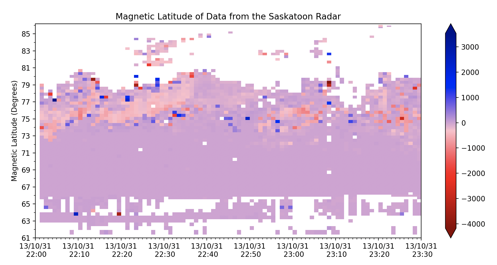
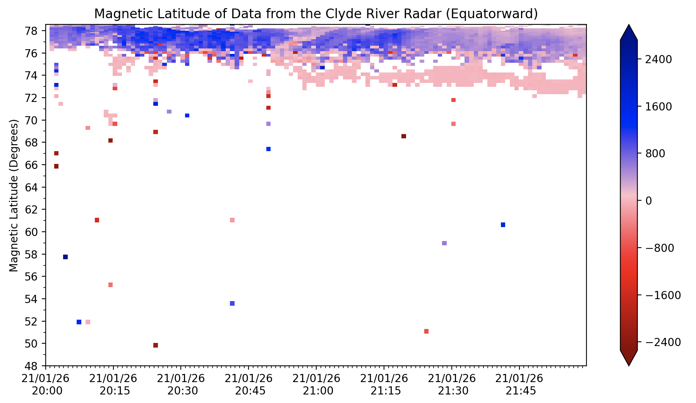
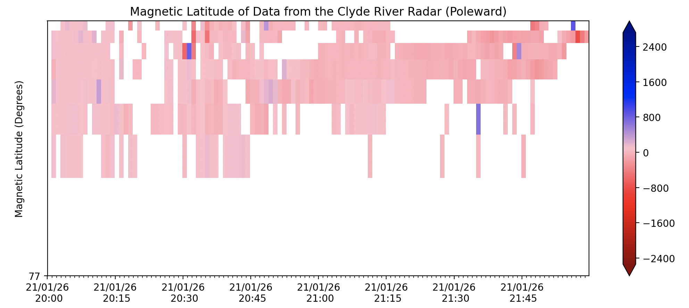

<!--Copyright (C) SuperDARN Canada, University of Saskatchewan 
Author(s): Carley Martin
Modifications:

Disclaimer:
pyDARN is under the LGPL v3 license found in the root directory LICENSE.md 
Everyone is permitted to copy and distribute verbatim copies of this license 
document, but changing it is not allowed.

This version of the GNU Lesser General Public License incorporates the terms
and conditions of version 3 of the GNU General Public License, supplemented by
the additional permissions listed below.
-->

# Coordinate-Time Parameter Plots
---

Similar to range-time plots, the coordinate-time plots allow the user to plot data with geographic or magnetic, longitude or latitude.
Coordinate-time plots have all the additional features as the range-time plots, however the plot by default will show magnetic latitude on the y-axis. Where a range estimation can be used to convert the range gate to a distance from the radar which is in turn converted into a location in latitude or longitude. 

Your plot can be made with a combination of the `range_estimate`, `coords` and `latlon` keywords.
For example, if `range_estimate=RangeEstimate.SLANT_RANGE`, `coords=Coords.AACGM` and `latlon='lat'`, this method will produce a plot with magnetic latitude on the y-axis calculated from the slant range value.

```
SDarn_read = pydarn.SuperDARNRead('file/name.fitacf')
fitacf_data = SDarn_read.read_fitacf()
pydarn.RTP.plot_coord_time(fitacf_data, beam_num=0,
                        range_estimation=pydarn.RangeEstimation.SLANT_RANGE,
                        latlon='lat', coords=pydarn.Coords.AACGM)
plt.title('Magnetic Latitude of Data from the Saskatoon Radar')
plt.ylabel('Magnetic Latitude (Degrees)')
plt.show()
```



!!! Warning
    This plotting method does not evaluate if the data is appropriate to plot in the given circumstances. Some radars point north and some are point longitudinally, therefore data shown in a plot may not be useful given the orientation.
    Some radars also have a field of view that may increase but then decrease in latitude, we have tried to solve this using the keyword `plot_equatorward`.

## Plot Equatorward?

As mentioned, some radar FOV go up then down in latitude. So that we do not overplot and potentially misrepresent data, the user can choose to plot the 'up' section of data (poleward), or the 'down' section of data (equatorward).
For example, using Clyde River data, you can use the `plot_equatorward` keyword to avoid overplotting and can see the data more clearly. The default for this keyword is `False`, however, the console will print information for you regarding the point at which the data changes direction and how to plot the remaining data. 

```
a = pydarn.RTP.plot_coord_time(fitacf_data, beam_num=0,
                            range_estimation=pydarn.RangeEstimation.SLANT_RANGE,
                            latlon='lat', coords=pydarn.Coords.AACGM,
                            plot_equatorward=True)
plt.title('Magnetic Latitude of Data from the Clyde River Radar (Equatorward)')
plt.ylabel('Magnetic Latitude (Degrees)')
plt.show()
```



```
a = pydarn.RTP.plot_coord_time(fitacf_data, beam_num=0,
                            range_estimation=pydarn.RangeEstimation.SLANT_RANGE,
                            latlon='lat', coords=pydarn.Coords.AACGM,
                            plot_equatorward=False)
plt.title('Magnetic Latitude of Data from the Clyde River Radar (Poleward)')
plt.ylabel('Magnetic Latitude (Degrees)')
plt.show()
```



!!! Note
    These same key words can also be used in the summary plot method to plot coordinate-time data in summary format. 