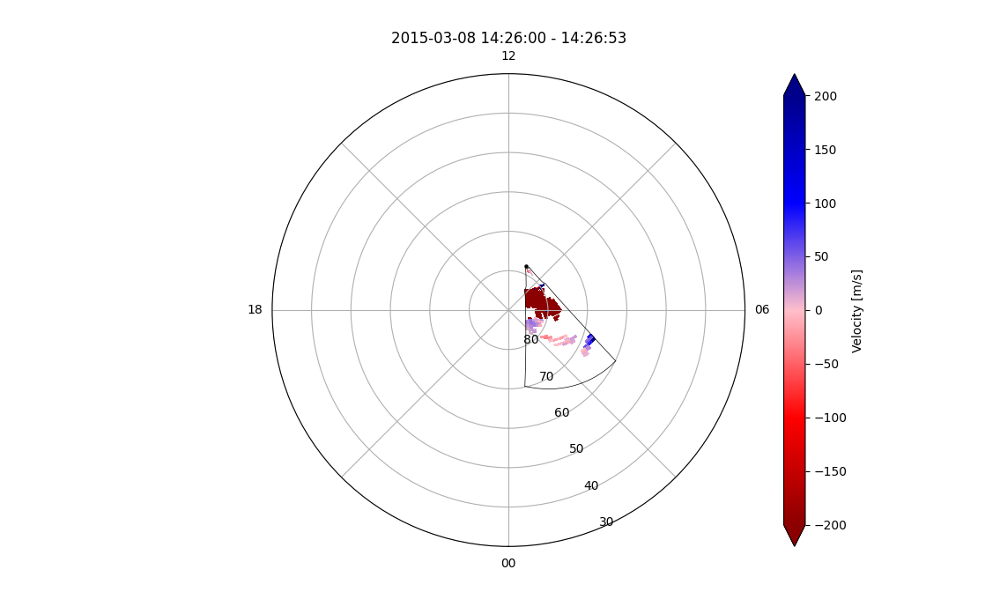
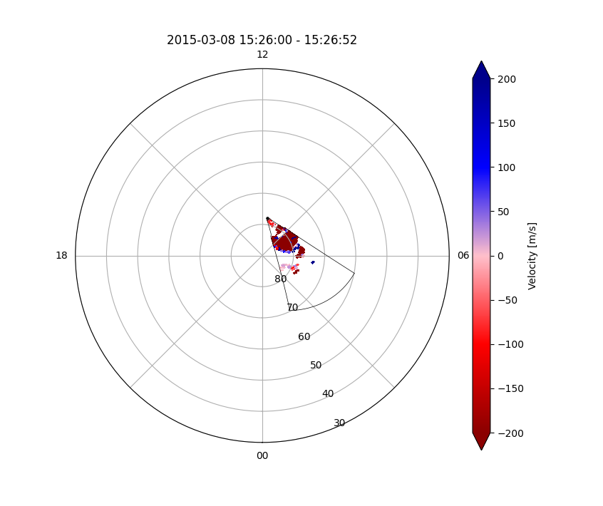
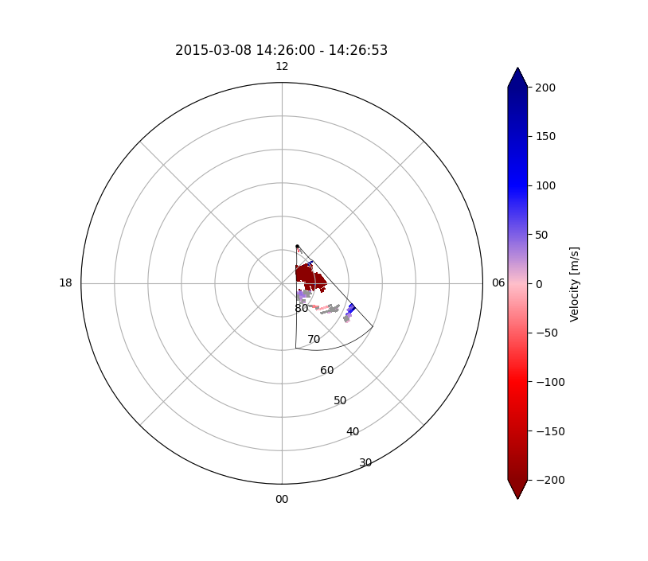
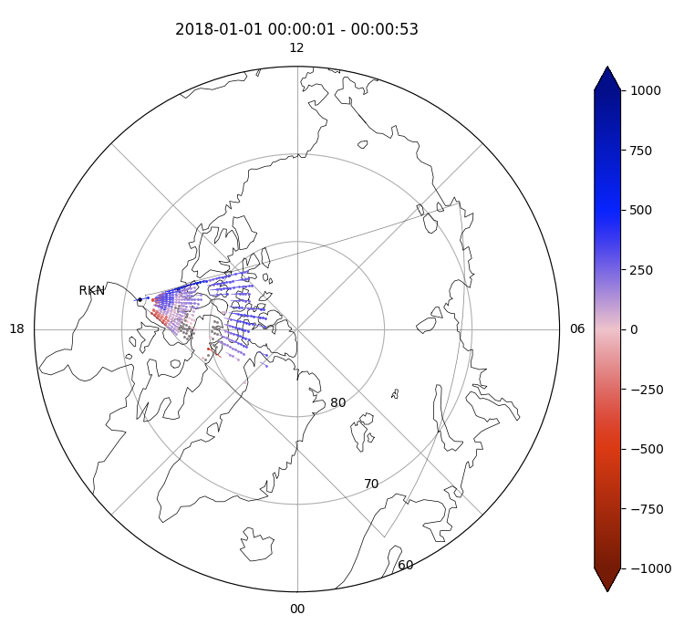
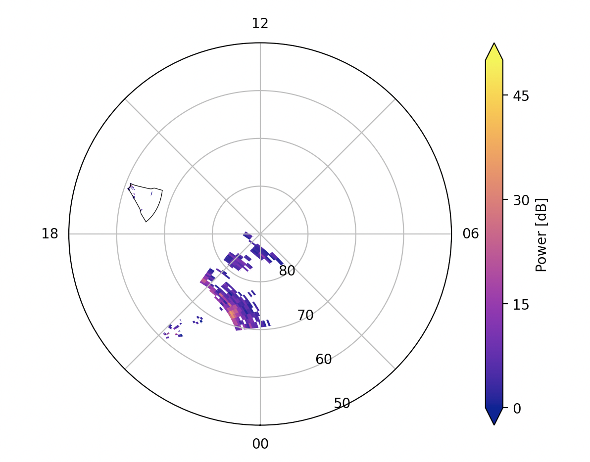
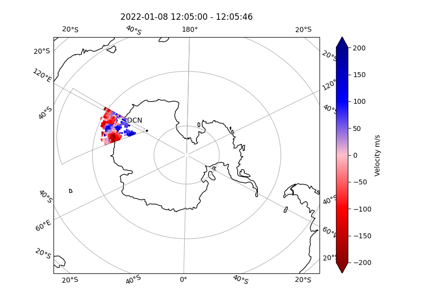
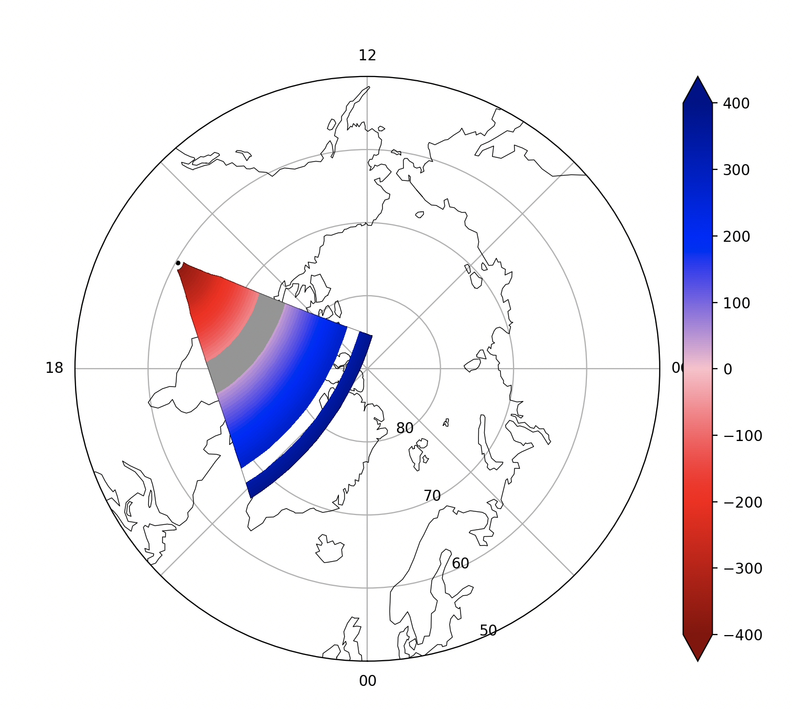

<!--Copyright (C) SuperDARN Canada, University of Saskatchewan 
Author(s): Daniel Billet 
Modifications:
20210922: CJM - included info on new channel option
20220912: CJM - Updated for new changes

Disclaimer:
pyDARN is under the LGPL v3 license found in the root directory LICENSE.md 
Everyone is permitted to copy and distribute verbatim copies of this license 
document, but changing it is not allowed.

This version of the GNU Lesser General Public License incorporates the terms
and conditions of version 3 of the GNU General Public License, supplemented by
the additional permissions listed below.
-->

# Fan plots
---

Fan plots are a way to visualise data from the entire scan of a SuperDARN radar. 

All beams and ranges for a given parameter (such as line-of-sight velocity, backscatter power, etc) and a particular scan can be projected onto a polar or geomagnetic plot in [AACGMv2](http://superdarn.thayer.dartmouth.edu/aacgm.html) coordinates, or projected onto a geographic plot in geographic coordinates.

### Basic usage
pyDARN and pyplot need to be imported, as well as any FITACF file needs to be [read in](https://pydarn.readthedocs.io/en/latest/user/SDarnRead/):

```python
import matplotlib.pyplot as plt
from datetime import datetime
import pydarn

#Read in fitACF file using SuperDARDRead, then read_fitacf
file = "path/to/fitacf/file"
SDarn_read = pydarn.SuperDARNRead(file)
fitacf_data = SDarn_read.read_fitacf()

```
With the FITACF data loaded as a list of dictionaries (`fitacf_data` variable in above example), you may now call the `plot_fan` method. Make sure you tell it which scan (numbered from first recorded scan in file, counting from 1 or give it a `datetime` object for the scan at that time) you want using `scan_index`:
```python
fan_rtn = pydarn.Fan.plot_fan(fitacf_data, scan_index=27, 
                              colorbar_label='Velocity [m/s]')
plt.show()
```
In this example, the 27th scan was plotted with the defaulted parameter being line-of-sight velocity:


You can also provide a `datetime` object to obtain a scan at a specific time: 
```python
pydarn.Fan.plot_fan(fitacf_data, scan_index=datetime(2015, 3, 8, 15, 26),
                     colorbar_label='Velocity [m/s]')
plt.show()
```



!!! Warning
    Do not include seconds in the datetime object, typically scans are 1 or 2 minutes long, so seconds may end in a error with no data. 


### Tolerance

You can also set a tolerance time as a timedelta object to plot only data around a specific number of seconds around a datetime given.
This is helpful to plot non-traditional scans and newer fast scans with a larger amount of data to separate.

If using `scan_time`, the user can also specify `scan_time_tolerance` as a datetime.timedelta object.

UNFINISHED PR, WILL AMEND HERE WHEN MERGED.


### Groundscatter

Default plots do not show groundscatter as grey. Set it to true to colour groundscatter:

```python
fan_rtn = pydarn.Fan.plot_fan(fitacf_data,
                              scan_index=27,
                              groundscatter=True)
plt.show()

```



### Parameters Available for Plotting

In addition to line-of-sight velocity, you can choose one of three other data products to plot by setting `parameter=String name`:

| Data product                          | String name |
|---------------------------------------|-------------|
| Line of sight velocity (m/s) [Default]| 'v'         |
| Spectral width (m/s)                  | 'w_l'       |
| Elevation angle (degrees)             | 'elv'       |
| Power (dB)                            | 'p_l'       |

### Ball and Stick Plots

Data on fan plots can also be displayed as a 'ball and stick' plot, where each data point is represented by a ball with a stick showing direction towards or away from the radar, coloured by the magnitude of the parameter plotted.
Ball and stick plots can be plotted usng the `ball_and_stick` with `len_factor` key words, as follows:

```
pydarn.Fan.plot_fan(fitacf_data,
                    scan_index=1, lowlat=60, zmin=-1000, zmax=1000,
                    boundary=True, radar_label=True,
                    groundscatter=True, ball_and_stick=True, len_factor=300,
                    coastline=True, parameter="v")
plt.show()
```



### Additional Options

Here is a list of all the current options than can be used with `plot_fan`

| Option                        | Action                                                                                                  |
| ----------------------------- | ------------------------------------------------------------------------------------------------------- |
| ax=(Axes Object)              | Matplotlib axes object than can be used for cartopy additions                                           |
| scan_index=(int or  datetime) | Scan number or datetime, from start of records in file corresponding to channel if given                |
| channel=(int or 'all')        | Specify channel number or choose 'all' (default = 'all')                                                |
| parameter=(string)            | See above table for options                                                                             |
| groundscatter=(bool)          | True or false to showing ground scatter as grey                                                         |
| ranges=(list)                 | Two element list giving the lower and upper ranges to plot, grabs ranges from hardware file (default [] |
| cmap=string                   | A matplotlib color map string                                                                           |
| grid=(bool)                   | Boolean to apply the grid lay of the FOV (default: False )                                              |
| zmin=(int)                    | Minimum data value for colouring                                                                        |
| zmax=(int)                    | Maximum data value for colouring                                                                        |
| colorbar=(bool)               | Set true to plot a colorbar (default: True)                                                             |
| colorbar_label=(string)       | Label for the colour bar (requires colorbar to be true)                                                 |
| title=(string)                | Title for the fan plot, default auto generated one based on input information                           |
| boundary=(bool)               | Set false to not show the outline of the radar FOV (default: True)                                      |
| coords=(Coords)               | [Coordinates](coordinates.md) for the data to be plotted in                                             |
| projs=(Projs)                 | Projections to plot the data on top of                                                                  |
| colorbar_label=(string)       | Label that appears next to the color bar, requires colorbar to be True                                  |
| coastline=(bool)              | Plots outlines of coastlines below data (Uses Cartopy)                                                  |
| beam=(int)                    | Only plots data/outline of specified beam (default: None)                                               |
| kwargs **                     | Axis Polar settings. See [polar axis](axis.md)                                                          |


!!! Note
    For some control programs, the user may need to specify a channel integer as `'all'` will not correctly show the data.
    In other cases, the user may want to specify the channel and use an integer (N) for the `scan_index`. Be aware that this will show the
    data for the Nth scan of only the chosen channel, not that of the entire file. 

### Plotting Multiple Fans on One Plot

You might have noticed that the variable `fan_rtn` in the examples above actually holds some information. This return value is a dictionary containing data in the plot, ax and ccrs values along with color map and color bar information:
```python
fan_rtn = pydarn.Fan.plot_fan(fitacf_data, scan_index=27)

print(fan_rtn.keys())
```
```
>>> dict_keys(['ax', 'ccrs', 'cm', 'cb', 'fig', 'data'])
```

`plot_fan` can concatenate with itself, here is an example of plotting two different radars with some of the above parameters, remember to pass in the axes object (`ax`) to any subsequent plots, unlike the FOV plots, fan plots will automatically control the `ccrs` variable for you:

```python
import pydarn
from datetime import datetime
import matplotlib.pyplot as plt 

cly_file = 'data/20150308.1400.03.cly.fitacf'
pyk_file = 'data/20150308.1401.00.pyk.fitacf'

pyk_data = pydarn.SuperDARNRead().read_dmap(pyk_file)
cly_data = pydarn.SuperDARNRead().read_dmap(cly_file)

fan_rtn = pydarn.Fan.plot_fan(cly_data, scan_index=datetime(2015, 3, 8, 14, 4),
                    colorbar=False, fov_color='grey', line_color='blue',
                    radar_label=True)

pydarn.Fan.plot_fan(pyk_data, scan_index=datetime(2015, 3, 8, 14, 4), 
                    colorbar_label='Velocity [m/s]', fov_color='grey',
                    line_color='red', radar_label=True, ax=fan_rtn['ax'])

plt.show()
```




### Coastlines

Plot an underlaid coastline map using the `coastline` keyword, this example also shows the use of plotting in geographic coordinates:

```python
pydarn.Fan.plot_fan(data, scan_index=5, radar_label=True,
                    groundscatter=True,
                    coords=pydarn.Coords.GEOGRAPHIC,
                    projs=pydarn.Projs.GEO,
                    colorbar_label="Velocity m/s",
                    coastline=True)
plt.show()
``` 




### User Input Data Fan Plots

As the scope of SuperDARN data expands, new control programs and modes of data collection are established, along with user requirements to average scans or plot non-standard data, it is increasingly difficult to develop an automatic fitacf to fan plot method that captures all of this nuance. 
In this case, we have introduced the user input fan plot where the user can make or massage data into their desired final product.
As long as it fits into the fan plot array (e.g. 16 beams and 75 range gates) then the data can be plotted on a fan plot.
This function also requires an identically sized array for groundscatter, if the user wishes.
The following is an example of completely made up data, with some ground scatter and ranges without data:

```python
import matplotlib.pyplot as plt
import pydarn
import datetime as dt
import numpy as np

# Test completely made up data for SAS
# Made up data in format [75, 16]
data_array = [(np.ones(16) * (x - 36) * 10).tolist() for x in range(75)]
# Add some areas with no data
for i in range(65,70):
    data_array[i] = (np.empty(16) * np.nan).tolist()

# Made up groundscatter boolean array
data_groundscatter = [(np.zeros(16)).tolist() for x in range(75)]
for i in range(30,40):
    data_groundscatter[i] = (np.ones(16)).tolist()

stid = 5
data_datetime = dt.datetime(2024,1,1,0,0)

pydarn.Fan.plot_fan_input(data_array=data_array,
                          data_datetime=data_datetime,
                          stid=stid,
                          data_groundscatter = data_groundscatter,
                          data_parameter='v',
                          zmin=-400,zmax=400, lowlat=50, coastline=True)
plt.show()

```

