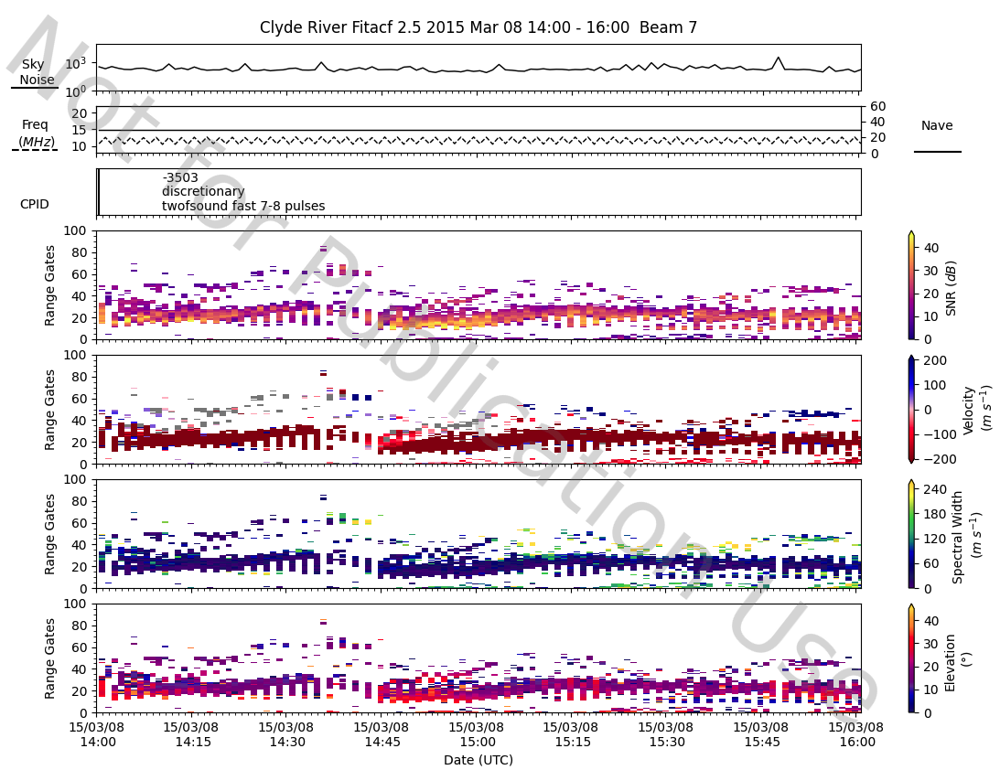
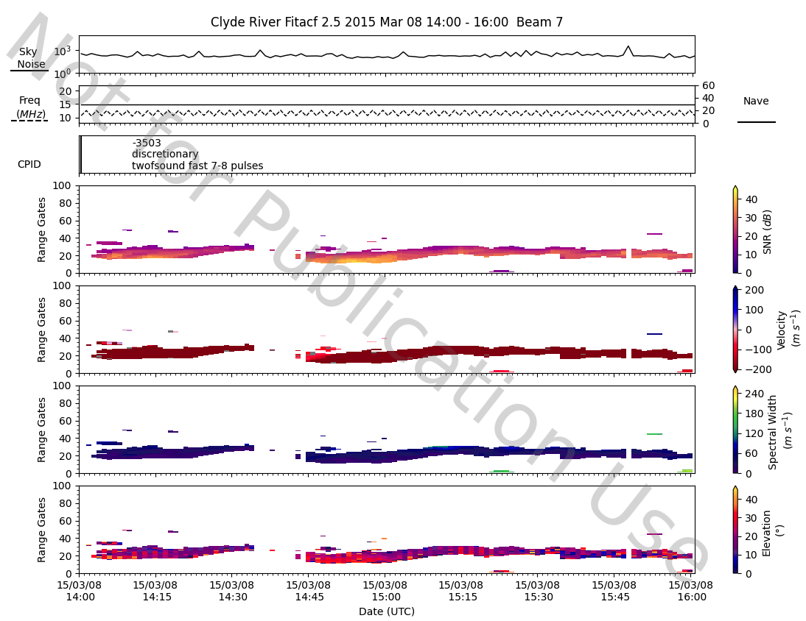

<!--Copyright (C) SuperDARN Canada, University of Saskatchewan 
Author(s): Carley Martin
Modifications:

Disclaimer:
pyDARN is under the LGPL v3 license found in the root directory LICENSE.md 
Everyone is permitted to copy and distribute verbatim copies of this license 
document, but changing it is not allowed.

This version of the GNU Lesser General Public License incorporates the terms
and conditions of version 3 of the GNU General Public License, supplemented by
the additional permissions listed below.
-->

# Filtering Data
---


Currently pyDARN has one filtering option. 

## Boxcar Filtering

!!! Note
    Filtering data can be computationally expensive and time consuming. Please
    allow around 5 minutes of processing time to filter a 2 hour FITACF file.
    Parallel processing options for the boxcar filter may be developled in the
    near future.


The boxcar filter filters data in time and 'space' (beams and gates) and is
available by evoking the `Boxcar` instance after reading a file.

```python
import pydarn

fitacf_file = "datafilename.fitacf"
darn_read = pydarn.SuperDARNRead(fitacf_file)
fitacf_data = darn_read.read_fitacf()

# Evoke filter on data
bx = pydarn.Boxcar(
    thresh=0.7,
    w=None
)
filtered_data = bx.run_filter(fitacf_data)
```

The variable `filtered_data` can be treated in the same way as the original data 
in `fitacf_data`. The data can be used to in any FITACF plotting methods. For example,
the code below produces comparisons between summary plots and fan plots for the same 
time frame. 

```python
import bz2
import matplotlib.pyplot as plt
import pydarn

with bz2.open('fitacffilename.fitacf.bz2') as fp:
    fitacf_stream = fp.read()
fitacf_data = pydarn.SuperDARNRead(fitacf_stream, True).read_fitacf()

# Before filtering:
pydarn.RTP.plot_summary(fitacf_data, beam_num=7,
                        range_estimation=pydarn.RangeEstimation.RANGE_GATE)
plt.show()

pydarn.Fan.plot_fan(fitacf_data, scan_index=10, coastline=True)
plt.show()

# Evoke filter on data
bx = pydarn.Boxcar(
    thresh=0.7,
    w=None
)
filtered_data = bx.run_filter(fitacf_data)

# After filtering
pydarn.RTP.plot_summary(filtered_data, beam_num=7,
                        range_estimation=pydarn.RangeEstimation.RANGE_GATE)
plt.show()

pydarn.Fan.plot_fan(filtered_data, scan_index=10, coastline=True)
plt.show()
```


