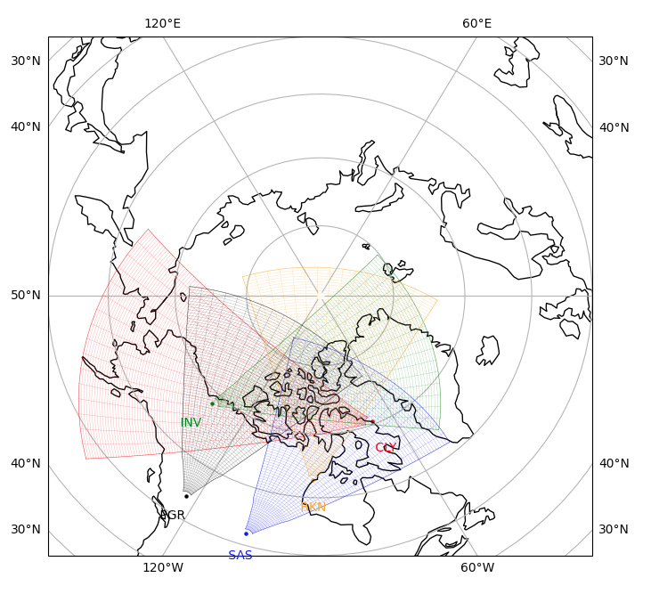

<!--Copyright (C) SuperDARN Canada, University of Saskatchewan 
Author(s): Marina Schmidt 
Modifications:
2022-03-31 MTS updating documentation with the new coordinate/cartopy system 
2022-09-12 CJM - Updated for new changes

Disclaimer:
pyDARN is under the LGPL v3 license found in the root directory LICENSE.md 
Everyone is permitted to copy and distribute verbatim copies of this license 
document, but changing it is not allowed.

This version of the GNU Lesser General Public License incorporates the terms
and conditions of version 3 of the GNU General Public License, supplemented by
the additional permissions listed below.
-->

# Field Of View Plots
---

Field Of View (FOV) plots show the radars scanning region for a given radar station id. 

```python
import pydarn
from datetime import datetime
import matplotlib.pyplot as plt 

pydarn.Fan.plot_fov(pydarn.RadarID.CLY, datetime(2015, 3, 8, 15, 0), radar_label=True)
plt.show()
```


A `datetime` object of the date is required to convert to `Coords.AACGM_MLT` (default) or `Coords.AACGM`.   

### Additional options

Here is a list of all the current options than can be used with `plot_fov`

| Option                  | Action                                                                                                  |
|-------------------------|---------------------------------------------------------------------------------------------------------|
| stid=pydarn.RadarID     | Station id of the radar.                                                                                |
| date=(datetime)         | `datetime` object to determine the position the radar fov AACGM or AACGM MLT coordinates                |
| ranges=(list)           | Two element list giving the lower and upper ranges to plot, grabs ranges from hardware file (default [] |
| ax=(Axes Object)        | Matplotlib axes object than can be used for cartopy additions                                           |
| ccrs=(object)           | Cartopy axes object for plotting using Cartopy                                                          |
| rsep=(int)              | Range Seperation (km) (default: 45 km)                                                                  |
| frang=(int)             | Frequency Range (km) (default: 180 km)                                                                  |
| projs=(Projs)           | Projection for the plot to be plotted on Polar and Geographic (GEO) (default: Projs.POLAR)              |
| coords=(Coords)         | Coorindates Geographic, AACGM, or AACGM MLT (default: Coords.AACGM_MLT)                                 |
| grid=(bool)             | Boolean to apply the grid lay of the FOV (default: False )                                              |
| colorbar=(bool)         | Set true to plot a colorbar (default: True)                                                             |
| colorbar_label=(string) | Label for the colour bar (requires colorbar to be true)                                                 |
| boundary=(bool)         | Set false to not show the outline of the radar FOV (default: True)                                      |
| grid=(bool)             | Set true to show the outline of the range gates inside the FOV (default: False)                         |
| fov_color=(string)      | Sets the fill in color for the fov plot (default: transparency)                                         |
| line_color=(string)     | Sets the boundary line and radar location dot color (default: black)                                    |
| alpha=(int)             | Sets the transparency of the fill color (default: 0.5)                                                  |
| line_alpha=(int)        | Sets the transparency of the boundary and grid lines if shown (default: 0.5)                            |
| radar_location=(bool)   | Places a dot in the plot representing the radar location (default: True)                                |
| radar_label=(bool)      | Places the radar 3-letter abbreviation next to the radar location                                       |
| coastline=(bool)        | Plots outlines of coastlines below FOV (Uses Cartopy)                                                   |
| beam=(int)              | Only plots outline/fill of specified beam (default: None)                                               |
| kwargs **               | Axis Polar settings. See [polar axis](axis.md)                                                          |


### Examples

To plot based on hemisphere or selection of radars, here is an example plotting North hemisphere radars with selected SuperDARN Canada radars colored as green, note that the axes object (ax) needs to be updated inside to loop to plot multiple FOV:

```python
import pydarn
from datetime import datetime
import matplotlib.pyplot as plt

fov_rtn = {}
fov_rtn['ax'] = None
for stid in pydarn.RadarID:
    if pydarn.SuperDARNRadars.radars[stid].hemisphere == pydarn.Hemisphere.North:
        if stid != pydarn.RadarID.SCH:
            if stid in [
                pydarn.RadarID.SAS,
                pydarn.RadarID.PGR,
                pydarn.RadarID.CLY,
                pydarn.RadarID.RKN,
                pydarn.RadarID.INV
            ]:
                fov_rtn = pydarn.Fan.plot_fov(stid, datetime(2021, 2, 5, 12, 5),
                                              radar_label=True, fov_color='green',
                                              line_color='green', alpha=0.8, ax=fov_rtn['ax'])
            else:
                fov_rtn = pydarn.Fan.plot_fov(stid, datetime(2021, 2, 5, 12, 5),
                                              radar_label=True, fov_color='blue',
                                              line_color='blue', alpha=0.2, lowlat=10,
                                              ax=fov_rtn['ax'])

plt.show()
```


This example will plot all radars in the southern hemisphere FOV in red:

```python
import pydarn
from datetime import datetime
import matplotlib.pyplot as plt

fov_rtn = {}
fov_rtn['ax'] = None
for stid in pydarn.RadarID:
    if pydarn.SuperDARNRadars.radars[stid].hemisphere == pydarn.Hemisphere.South:
        if stid != pydarn.RadarID.SCH:
            fov_rtn = pydarn.Fan.plot_fov(stid, datetime(2021, 2, 5, 12, 5),
                                          radar_label=True, fov_color='red',
                                          line_color='red', alpha=0.2, ax=fov_rtn['ax'])
plt.show()
```


This example shows plotting in geographic coordinates with the coastline outlines. 

```python
import pydarn
from datetime import datetime
import matplotlib.pyplot as plt 

pydarn.Fan.plot_fov(stid=pydarn.RadarID.RKN, date=datetime(2022, 1, 8, 14, 5),
                    fov_color='red', coords=pydarn.Coords.GEOGRAPHIC,
                    projs=pydarn.Projs.GEO, coastline=True)
plt.show()
```


!!! Note
    If plotting multiple FOV on one plot for geographic coordinates, it is required that the `ax` and `ccrs` of the initial plot is read into the subsequent plots. Each subsequent plot also needs to be told that it is supposed to be in geographic coordinates and/or geographic projection using the  `coords` and `projs` keywords.

This is an example of multiple FOV in geographic coordinates using the correct set of keywords.

```python
import pydarn
from datetime import datetime
import matplotlib.pyplot as plt 

fov_rtn = pydarn.Fan.plot_fov(pydarn.RadarID.CLY, datetime(2021, 6, 21, 6, 0),
                              lowlat= 50, boundary=True, radar_label=True,
                              line_color='red', grid = True,
                              coords=pydarn.Coords.GEOGRAPHIC,
                              projs=pydarn.Projs.GEO, coastline=True)
pydarn.Fan.plot_fov(pydarn.RadarID.SAS, datetime(2021, 2, 5, 12, 5), radar_label=True,
                    ax=fov_rtn['ax'], ccrs=fov_rtn['ccrs'], boundary=True,
                    line_color='blue', grid = True,
                    coords=pydarn.Coords.GEOGRAPHIC,
                    projs=pydarn.Projs.GEO)
pydarn.Fan.plot_fov(pydarn.RadarID.INV, datetime(2021, 2, 5, 12, 5), radar_label=True,
                    ax=fov_rtn['ax'], ccrs=fov_rtn['ccrs'],
                    boundary=True, line_color='green',
                    grid = True, coords=pydarn.Coords.GEOGRAPHIC,
                    projs=pydarn.Projs.GEO)
pydarn.Fan.plot_fov(pydarn.RadarID.RKN, datetime(2021, 2, 5, 12, 5), radar_label=True,
                    ax=fov_rtn['ax'], ccrs=fov_rtn['ccrs'],
                    boundary=True, line_color='orange',
                    grid = True, coords=pydarn.Coords.GEOGRAPHIC,
                    projs=pydarn.Projs.GEO)
pydarn.Fan.plot_fov(pydarn.RadarID.PGR, datetime(2021, 2, 5, 12, 5), radar_label=True,
                    ax=fov_rtn['ax'], ccrs=fov_rtn['ccrs'],
                    boundary=True, grid = True,
                    coords=pydarn.Coords.GEOGRAPHIC, projs=pydarn.Projs.GEO)
plt.show()
```




To obtain only dots and labels:

```python
import pydarn
from datetime import datetime
import matplotlib.pyplot as plt 

pydarn.Fan.plot_fov(pydarn.RadarID.CLY, datetime(2021, 2, 5, 12, 5), boundary=False,
                    radar_label=True)
plt.show()
```


!!! Note
    The radar label positions have been manually set in geographic and geomagnetic coordinates so that no labels overlap. Users can plot their own labels using `plt.text(*lon psn in radians/degrees*, *lat psn in degrees*, *text string*)` if the current position used is not suitable. You may need to include a Cartopy transform if using the GEO or MAG projections from Cartopy.


