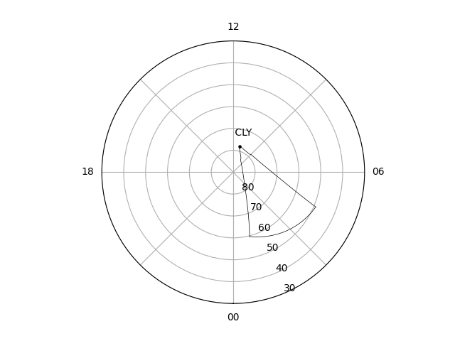
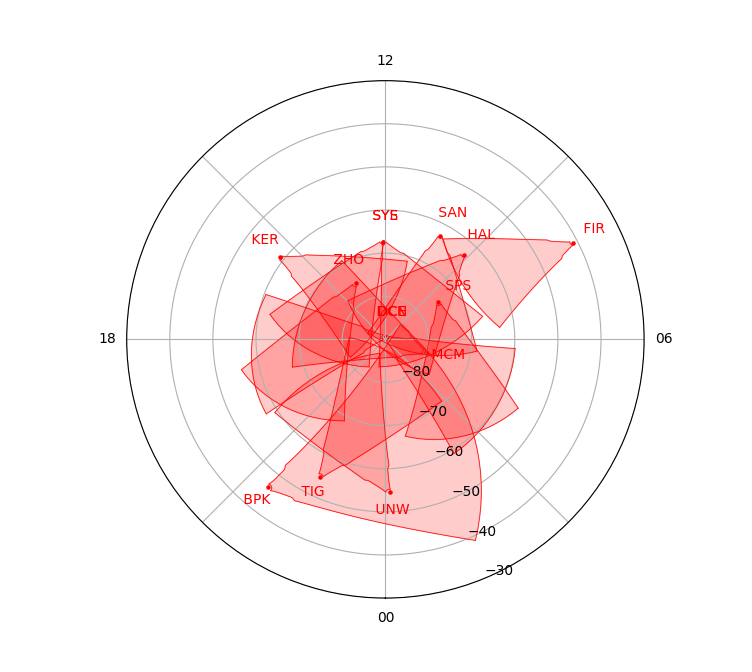
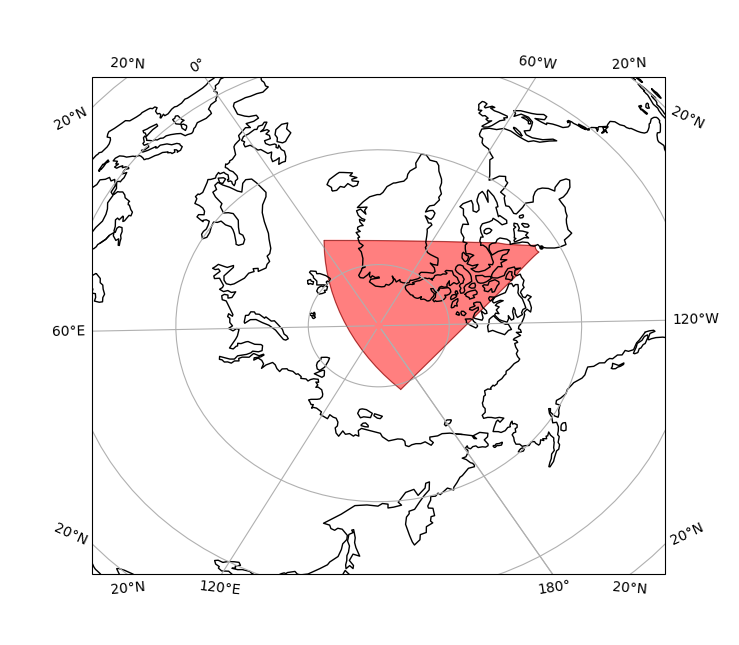
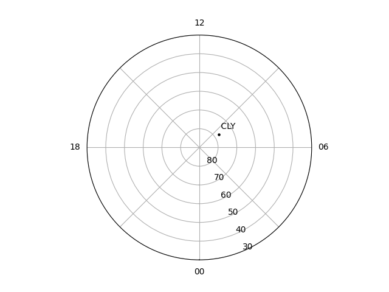

<!--Copyright (C) SuperDARN Canada, University of Saskatchewan 
Author(s): Marina Schmidt 
Modifications:
2022-03-31 MTS updating documentation with the new coordinate/cartopy system 

Disclaimer:
pyDARN is under the LGPL v3 license found in the root directory LICENSE.md 
Everyone is permitted to copy and distribute verbatim copies of this license 
document, but changing it is not allowed.

This version of the GNU Lesser General Public License incorporates the terms
and conditions of version 3 of the GNU General Public License, supplemented by
the additional permissions listed below.
-->

# Field Of View Plots
---

Field Of View (FOV) plots show the radars scanning region for a given radar station id. 

```python
import pydarn
from datetime import datetime
import matplotlib.pyplot as plt 

pydarn.Fan.plot_fov(66, datetime(2015, 3, 8, 15, 0), radar_label=True)
plt.show()
```



A `datetime` object of the date is required to convert to `Coords.AACGM_MLT` (default) or `Coords.AACGM`.   

### Additional options

Here is a list of all the current options than can be used with `plot_fov`

| Option                  | Action                                                                                                  |
| ----------------------- | ------------------------------------------------------------------------------------------------------- |
| stid=(int)              | Station id of the radar. Can be found using [SuperDARNRadars](hardware.md)                              |
| date=(datetime)         | `datetime` object to determine the position the radar fov AACGM or AACGM MLT coordinates                |
| ranges=(list)           | Two element list giving the lower and upper ranges to plot, grabs ranges from hardware file (default [] |
| ccrs=(object)           | Cartopy axes object for plotting using Cartopy                                                          |
| rsep=(int)              | Range Seperation (km) (default: 45 km)                                                                  |
| frang=(int)             | Frequency Range (km) (default: 180 km)                                                                  |
| projs=(Projs)           | Projection for the plot to be plotted on Polar and Geographic (GEO) (default: Projs.POLAR)              |
| coords=(Coords)         | Coorindates Geographic, AACGM, or AACGM MLT (default: Coords.AACGM_MLT)                                 |
| grid=(bool)             | Boolean to apply the grid lay of the FOV (default: False )                                              |
| colorbar=(bool)         | Set true to plot a colorbar (default: True)                                                             |
| colorbar_label=(string) | Label for the colour bar (requires colorbar to be true)                                                 |
| boundary=(bool)         | Set false to not show the outline of the radar FOV (default: True)                                      |
| grid=(bool)             | Set true to show the outline of the range gates inside the FOV (default: False)                         |
| fov_color=(string)      | Sets the fill in color for the fov plot (default: transparency)                                         |
| line_color=(string)     | Sets the boundary line and radar location dot color (default: black)                                    |
| alpha=(int)             | Sets the transparency of the fill color (default: 0.5)                                                  |
| line_alpha=(int)        | Sets the transparency of the boundary and grid lines if shown (default: 0.5)                            |
| radar_location=(bool)   | Places a dot in the plot representing the radar location (default: True)                                |
| radar_label=(bool)      | Places the radar 3-letter abbreviation next to the radar location                                       |
| kwargs **               | Axis Polar settings. See [polar axis](axis.md)                                                          |

To plot based on hemisphere or selection of radars, here is an example plotting North hemisphere radars with selected SuperDARN Canada radars colored as green:

```python
for stid in pydarn.SuperDARNRadars.radars.keys():
    if pydarn.SuperDARNRadars.radars[stid].hemisphere == pydarn.Hemisphere.North:
        if stid != 2:
            if stid in [66, 65, 6, 65, 5]: 
                pydarn.Fan.plot_fov(stid, datetime(2021, 2, 5, 12, 5), 
                                    radar_label=True, fov_color='green',
                                    line_color='green', alpha=0.8)

            pydarn.Fan.plot_fov(stid, datetime(2021, 2, 5, 12, 5), 
                                radar_label=True, fov_color='blue',
                                line_color='blue', alpha=0.2, lowlat=10)

plt.show()
```


This example will plot the South Hemisphere radars FOV in red:

```python
for stid in pydarn.SuperDARNRadars.radars.keys():
    if pydarn.SuperDARNRadars.radars[stid].hemisphere == pydarn.Hemisphere.South:
        if stid != 2:
            pydarn.Fan.plot_fov(stid, datetime(2021, 2, 5, 12, 5),
                                radar_label=True, fov_color='red',
                                line_color='red', alpha=0.2)
plt.show()
```




This example shows the use of *cartopy* and plotting in geographic coordinates. 

```python
_ , _, ax, ccrs = pydarn.Fan.plot_fov(stid=65,
                                      date=dt.datetime(2022, 1, 8, 14, 5),
                                      fov_color='red',
                                      coords=pydarn.Coords.GEOGRAPHIC,
                                      projs=pydarn.Projs.GEO)
ax.coastlines()
plt.show()
```



!!! Warning
    Currently you cannot plot AACGM coordinates on a geographic plot as its not correctly transformed. Currently in development. 


`plot_fov` use two other plotting methods `plot_radar_position` and `plot_radar_label`, these methods have the following parameters: 

| Option              | Action                                                                     |
| ------------------- | -------------------------------------------------------------------------- |
| stid=(int)          | Station id of the radar. Can be found using [SuperDARNRadars](hardware.md) |
| date=(datetime)     | `datetime` object to determine the position the radar fov is in MLT        |
| line_color=(string) | Sets the text and radar location dot color (default: black)                |

!!! Note
    These methods do not plot on a polar axis so it is strongly encouraged to use `plot_fov` to use them. 

To obtain only dots and labels:

```python
pydarn.Fan.plot_fov(66, datetime(2021, 2, 5, 12, 5), boundary=False,
                    radar_label=True)
```



!!! Note
    The radar labels will appear at the same longitude, but at -5 degrees of latitude to the position of the radar station. This may cause some to overlap. Users can plot their own labels using `plt.text(*lon psn in radians*, *lat psn in degrees*, *text string*)`


