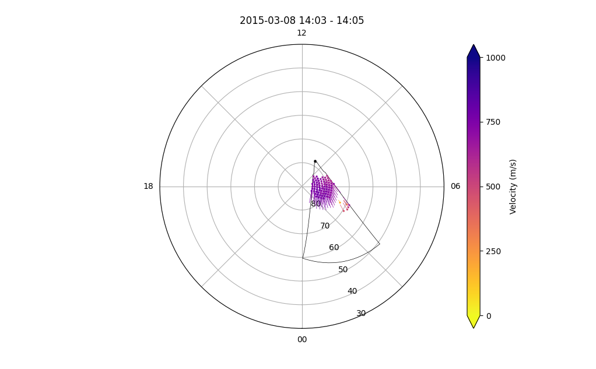

<!--Copyright (C) SuperDARN Canada, University of Saskatchewan 
Author(s): Marina Schmidt 
Modifications:

Disclaimer:
pyDARN is under the LGPL v3 license found in the root directory LICENSE.md 
Everyone is permitted to copy and distribute verbatim copies of this license 
document, but changing it is not allowed.

This version of the GNU Lesser General Public License incorporates the terms
and conditions of version 3 of the GNU General Public License, supplemented by
the additional permissions listed below.
-->

# Grid plots
---

Grid plots are a way to visualise data from a GRID file of a SuperDARN radar(s). Please read RST documentation on how to process [GRID files and GRD files](https://radar-software-toolkit-rst.readthedocs.io/en/latest/user_guide/make_grid/) from grid files.    

Gridded given [parameter](https://radar-software-toolkit-rst.readthedocs.io/en/latest/references/general/grid/) such as:

| Name                    | parameter name |
| ----------------------- | -------------- |
| Light-of-sight Velocity | `vec`          |
| Power                   | `pwr`          |
| Spectral Width          | `wdt`          |

and a time or record number projected onto a polar format plot in [AACGMv2](http://superdarn.thayer.dartmouth.edu/aacgm.html) coordinates. 


Currently, grid plots in pyDARN get the geomagnetic positions from the GRID file [`mlon` and `mlat`](https://pypi.org/project/aacgmv2/) that uses AACGMv2 coordinates. In the future, pyDARN will generate the geographical position, which will bring support for not standard gridded vector layouts.

### Basic usage

pyDARN and pyplot need to be imported, as well as any GRID file needs to be [read in](https://pydarn.readthedocs.io/en/master/user/SDarnRead/):

```python
import matplotlib.pyplot as plt
import pydarn

#Read in grid file using SuperDARDRead, then read_grid
file = "path/to/grid/file"
SDarn_read = pydarn.SuperDARNRead(file)
grid_data = SDarn_read.read_grid()

```
With the grid data loaded as a list of dictionaries (`grid_data` variable in above example), you may now call the `plot_grid` method. Make sure you tell it which time or record (numbered from first recorded in file, counting from 0):
```python
import datetime as dt

stime = dt.datetime(year, month, day, hour, minute)
gridplot = pydarn.Grid.plot_grid(grid_data, start_time=stime)
plt.show()

```
In this example, the record at `stime` was plotted with the defaulted parameter being gridded line-of-sight velocity:


You might have noticed that the variable `gridplot` in the examples above actually holds some information. This contains the AACGM latitude and longitude of the gridded vectors plotted, as well as the data. If you instead change `gridplot` to 3 separate variables, it will return the latitude, longitude, and data info into separate variables:
```python
lats,lons,data=pydarn.Grid.plot_grid(grid_data, start_time=stime)
```

### Additional parameters

In addition to gridded  line-of-sight velocity, you can choose one of three other data products to plot by setting `parameter=String name`:

| Data product                          | String name |
|---------------------------------------|-------------|
| Line of sight velocity (m/s) [Default]| `vec`       |
| Spectral width (m/s)                  | `wdt`       |
| Power (dB)                            | `pwr`       |

### Additional options

Here is a list of all the current options than can be used with `plot_grid`

| Option                         | Action                                                                                |
| ------------------------------ | ------------------------------------------------------------------------------------- |
| record=(int)                   | Record number to plot                                                                 |
| start_time=(datetime.datetime) | The start time of the record to plot                                                  |
| time_delta=(int)               | How close to the start time to be to the start time of the record                     |
| lowlat=(int)                   | Control the lower latitude boundary of the plot (default 30/-30 AACGM lat)            |
| fov=(bool)                     | Boolean to show the radars Field-of-View                                              |
| cmap=matplotlib.cm             | A matplotlib color map object. Will override the pyDARN defaults for chosen parameter |
| zmin=(int)                     | Minimum data value for colouring                                                      |
| zmax=(int)                     | Maximum data value for colouring                                                      |
| colorbar=(bool)                | Set true to plot a colorbar (default: True)                                           |
| colorbar_label=(string)        | Label for the colour bar (requires colorbar to be true)                               |
| title=(str)                    | To add a title to the plot                                                            |

As an example, the following code plots multiple radar Grid plot:
```python

```

