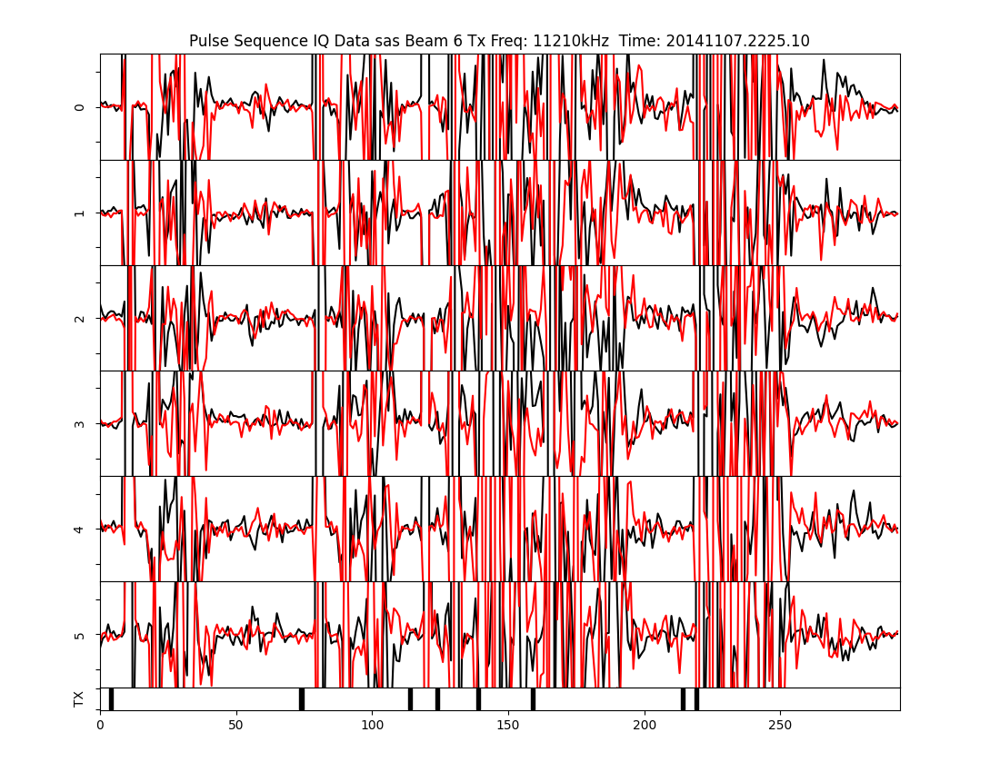
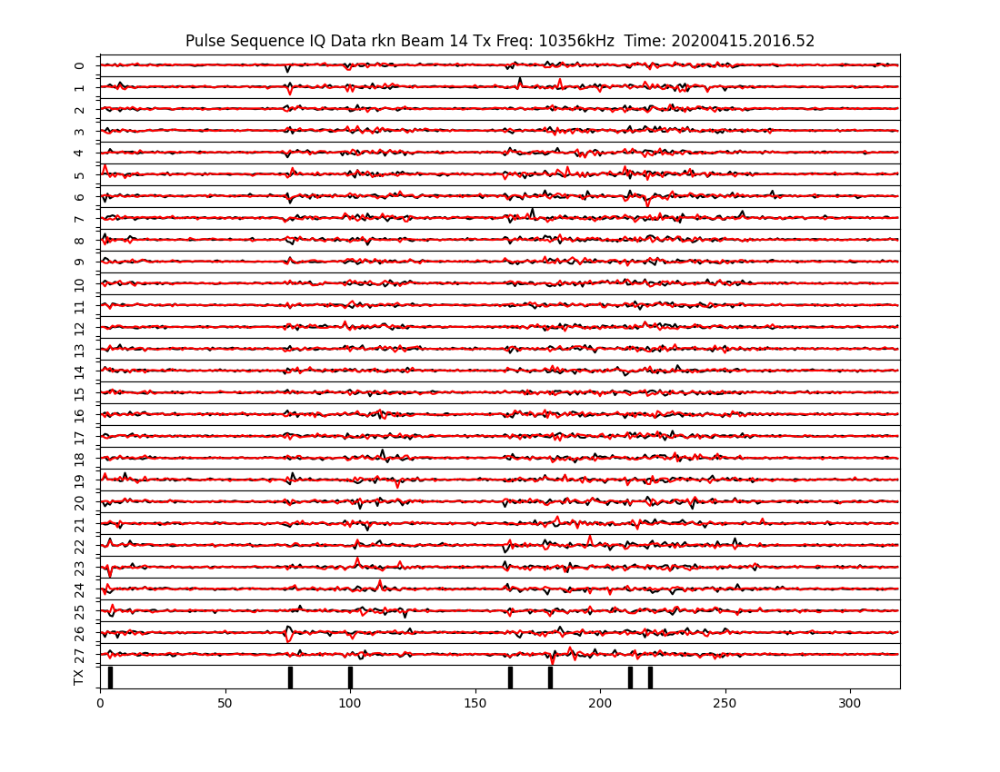

# Using IQ Data

An example script that reads IQDAT files and optionally plots them or creates WAV files from them 
is available in the examples directory.

## I and Q vs Sample number plotting

Basic usage of the script to plot an IQ waveform vs sample num from an IQDAT file (along with output)
 would look like:
```bash
python3 iq_plot_listen.py --plot /path/to/iq/files/20141107.2225.03.sas.iqdat.gz
Plotting each IQ record from /path/to/iq/files/20141107.2225.03.sas.iqdat.gz
 ** NOTE ** This takes a long time, go for a walk and stretch
Finished record 1/597
Finished record 120/597
Finished record 239/597
Finished record 358/597
Finished record 477/597
Finished record 596/597
Finished record 597/597
```    

This will produce a directory in the current working directory called ```iq_plots/``` and place
all resulting plots (one for each record) in that directory. The output file names are of the form:
```YYYYMMDD.HHMM.SS.abbrev.bm##.png```

The ```bm##``` will print ```bm4``` for beam 4, ```bm15``` for beam 15, and so on.

The resulting plots look similar to the following from Saskatoon and Rankin Inlet radars:



You'll notice that this image contains 6 sequences, the transmit pulse timing is located on the
bottom of the plot, and the I and Q waveforms are plotted in red and black for each sequence
in the record starting at the time in the filename.



You'll notice that this record contains 28 pulse sequences.

## WAV file generation

An example stereo WAVV file that has been compressed using an mp3 codec can be found on 
pydarn's github in the examples directory: 
([here](hhttps://github.com/SuperDARN/pydarn/tree/master/docs/examples))

Another example, if you wish to produce a WAV file (one WAV file per IQDAT file) with output is:

```bash
python3 iq_plot_listen.py --listen /path/to/iq/files/20141107.2225.03.sas.iqdat.bz2
Generating WAV files for each IQ record from /path/to/iq/files/20141107.2225.03.sas.iqdat.bz2
```

This will produce a directory in the current working directory called ```iq_wav/``` and place
the resulting WAV file in that directory. The output file names are of the form:
```YYYYMMDD.HHMM.SS.abbrev.bm##.wav```

## Plotting and generating WAV files

Another example, if you wish to both produce plots and a WAV file:

```bash
python3 iq_plot_listen.py --listen --plot /path/to/iq/files/20200415.2016.52.rkn.iqdat
```

## Stereo Support

The examples above will produce mono WAV files using only the real (I) component of the 
waveform in the IQDAT files. If you wish, it's possible to generate a WAV file with the I and Q
components in stereo channels. This just requires the ```--stereo``` flag:

```bash
python3 iq_plot_listen.py --listen --stereo /path/to/iq/files/20141107.2225.03.sas.iqdat
```

## Input file requirements

If you've been paying attention up to this point, you'll have noticed that the file extension
for the examples above has been ```gz```, ```bz2``` and ```iqdat```.
The input file to this example script currently needs to be a DMAP IQDAT file. It can be compressed
with gzip, bzip2 or uncompressed. The example script will handle any of these three compression 
types.
