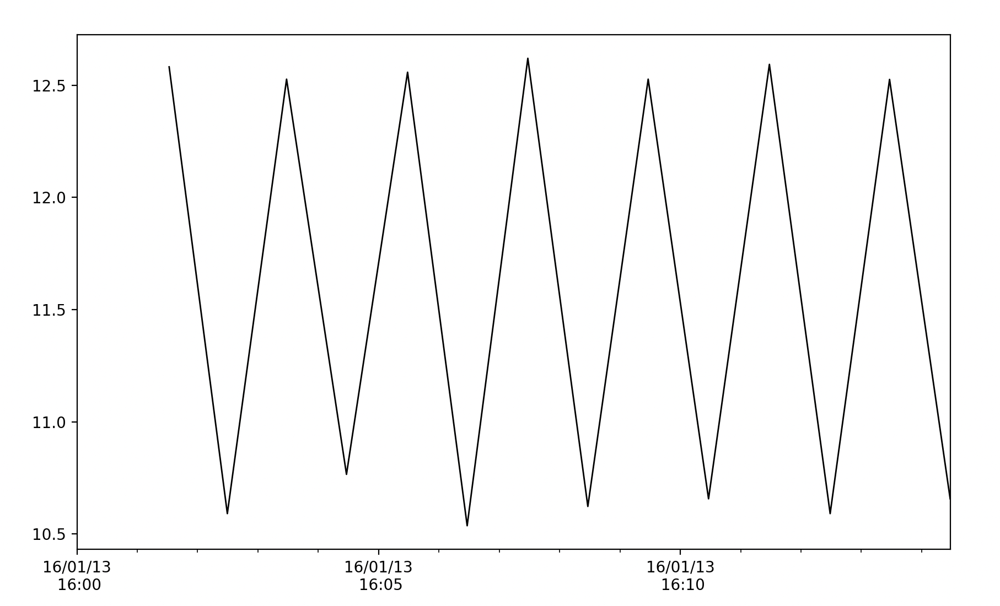
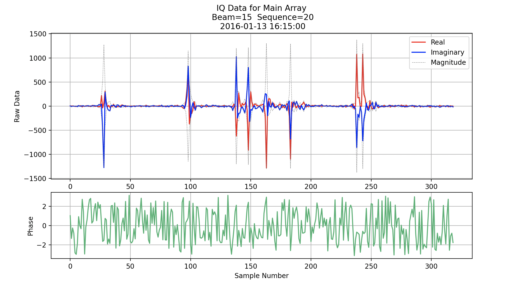
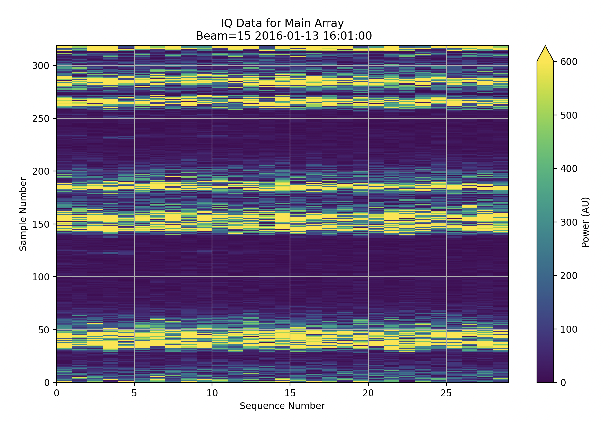
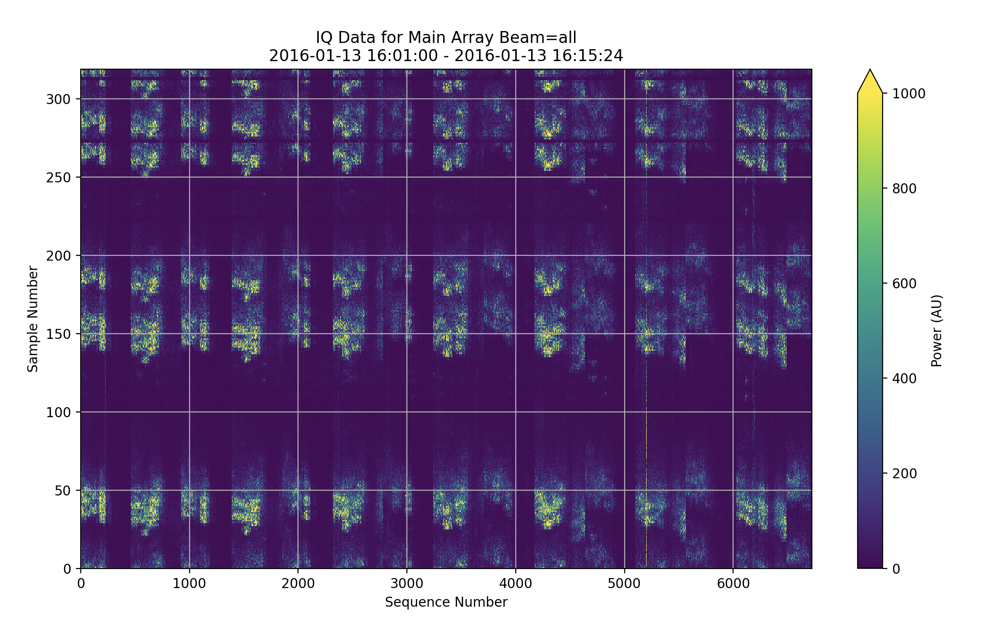

<!--Copyright (C) 2023 SuperDARN Canada, University of Saskatchewan 
Author(s): Carley Martin 
Modifications:

Disclaimer:
pyDARN is under the LGPL v3 license found in the root directory LICENSE.md 
Everyone is permitted to copy and distribute verbatim copies of this license 
document, but changing it is not allowed.

This version of the GNU Lesser General Public License incorporates the terms
and conditions of version 3 of the GNU General Public License, supplemented by
the additional permissions listed below.
-->

# IQ Data and Plotting

## Reading IQ Data

```python
import pydarn
iq_file = 'path/to/file/iqdata.iqdat'
iq_data = pydarn.SuperDARNRead(iq_file).read_iqdat()
```

!!! Note
    These methods only work for iqdat formatted files. 
    You can use pyDARNio to read antennas IQ data, or bfiq data. 
    bfiq data can be converted to iqdat for plotting.

## IQ Plotting Options
### IQ Time Series Plots

These plots show any of the scalar products found in the IQ file. This method directly calls the time series method in the RTP module.

```python
pydarn.IQ.plot_time_series(iq_data, beam_num = 7, parameter='tfreq')
plt.show()
```



### IQ Sequence Plots

The IQ sequence plots will plot the real and imaginary parts of a single sequence of data. There are additional options to view the phase.
You can also choose to view the IQ data from the main array, or the interferometer array using the key work `interferometer`.

```python
pydarn.IQ.plot_iq_sequence(iq_data, start_time=datetime(2016,1,13,16,15),
                           beam_num=15, sequence_num = 20,
                           interferometer=False, plot_phase=True)
plt.show()
```



### IQ Record Plots

Record plots will plot a single record in a file, given a beam.
You can also choose to view the IQ data from the main array, or the interferometer array using the key work `interferometer`.

```python
pydarn.IQ.plot_iq_record(iq_data, start_time=datetime(2016,1,13,16,0),
                           beam_num=15, interferometer=False)
plt.show()
```



### IQ Overview Plots

Overview plots will plot every sequence found in a file for a given beam. All beams is also an option. 
You can also choose to view the IQ data from the main array, or the interferometer array using the key work `interferometer`.

```python
pydarn.IQ.plot_iq_overview(iq_data, beam_num='all', interferometer=False)
plt.show()
```




