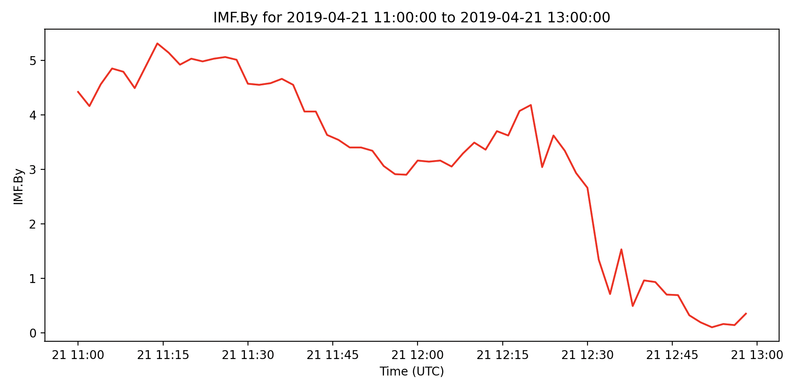

<!--Copyright (C) 2021 SuperDARN Canada, University of Saskatchewan 
Author(s): Marina Schmidt 
Modifications:

Disclaimer:
pyDARN is under the LGPL v3 license found in the root directory LICENSE.md 
Everyone is permitted to copy and distribute verbatim copies of this license 
document, but changing it is not allowed.

This version of the GNU Lesser General Public License incorporates the terms
and conditions of version 3 of the GNU General Public License, supplemented by
the additional permissions listed below.
-->

# Map Data Plots
---

## Convection Maps
Map plots are a way to visualize data from a MAP file of SuperDARN radar data. Please read RST documentation on how to process [MAP files](https://radar-software-toolkit-rst.readthedocs.io/en/latest/user_guide/map_grid/) from GRID files.    

Map field descriptions can be found [here](https://radar-software-toolkit-rst.readthedocs.io/en/latest/references/general/map/). pyDARN uses a `enum` object to select different common parameters to plot in a MAP file:

| Name               | parameter name                | Map field name                |
| ------------------ | ----------------------------- | ----------------------------- |
| Fitted Velocity    | `MapParams.FITTED_VELOCITIES` | see Fitted Velocities section |
| Modeled Velocities | `MapParams.MODEL_VELOCITIES`  | `model.vel.median`            |
| Raw Velocities     | `MapParams.RAW_VELOCITIES`    | `vector.vel.median`           |
| Power              | `MapParams.POWER`             | `vector.pwr.median`           |
| Spectral Width     | `MapParams.SPECTRAL_WIDTH`    | `vector.wdt.median`           |

for a given `start_time` or `record` number projected onto a polar plot in [AACGMv2](http://superdarn.thayer.dartmouth.edu/aacgm.html) coordinates. 

Currently, map plots in pyDARN get geomagnetic positions of the mapped data in [`mlon` and `mlat`](https://pypi.org/project/aacgmv2/) from the MAP file, which uses AACGMv2 coordinates.

### Fitted Velocities

Fitted velocities are velocity vectors which represent the fitted convection pattern. They are entirely in the direction of the fitted convection flow and so can be fairly different to line-of-sight velocities, but still ultimately constrained by them. 

Fitted velocity vectors are by default only calculated at the same positions of the line-of-sight vectors, but fit vectors at an arbitrary position can be obtained by using the `calculated_fitted_velocities` function in `map.py`.

## Basic usage

pyDARN and pyplot need to be imported and the desired MAP file needs to be [read in](https://pydarn.readthedocs.io/en/main/user/io/):

```python
import matplotlib.pyplot as plt
import pydarn

file = "path/to/grid/file"
map_data, _ = pydarn.read_map(file)

```
With the map data loaded as a list of dictionaries (`map_data` variable in above example), you may now call the `plot_mapdata` method. Make sure you tell the method what time, in `datetime` format, or record number (numbered from first recorded in file, counting from 0):
```python
map_rtn = pydarn.Maps.plot_mapdata(map_data, record=150)
plt.show()

```
In this example, the record at 150 was plotted with the defaulted parameter, `MapParams.FITTED_VELOCITIES` (fitted velocities):


You might have noticed that the variable `map_rtn` in the examples above actually holds some information. This dictionary contains the AACGM latitude and longitude of the mapped vectors plotted:
```python
map_rtn = pydarn.Maps.plot_mapdata(map_data, start_time=stime)
print(map_rtn.keys())
```

### Additional options

Here is a list of all the current options than can be used with `plot_mapdata`

| Option                         | Action                                                                                |
| ------------------------------ | ------------------------------------------------------------------------------------- |
| record=(int)                   | Record number to plot                                                                 |
| start_time=(datetime.datetime) | The start time of the record to plot                                                  |
| time_delta=(int)               | How close to the start time to be to the start time of the record                     |
| parameter=(Enum)               | Specify the required parameter described above i.e. `pydarn.MapParams.FITTED_VELOCITY` |
| lowlat=(int)                   | Control the lower latitude boundary of the plot (default 30/-30 AACGM lat)            |
| len_factor=(int)               | Normalisation factor for the length of the vectors on the plot                        |
| boundary=(bool)                | Boolean to show the Field-of-View of the radar(s)                                     |
| cmap=matplotlib.cm             | A matplotlib color map object. Will override the pyDARN defaults for chosen parameter |
| zmin=(int)                     | Minimum data value for colouring                                                      |
| zmax=(int)                     | Maximum data value for colouring                                                      |
| color_vectors=(bool)           | Choose if the vectors are plotted with corresponding color map (True), or in black    |
| colorbar=(bool)                | Set true to plot a colorbar (default: True)                                           |
| colorbar_label=(string)        | Label for the colour bar (requires colorbar to be true)                               |
| contour_colorbar=(bool)        | Set True to show color bar for contour color map (default:True if contour_fill=True)  |
| title=(str)                    | To add a title to the plot                                                            |
| hmb=(bool)                     | Set to True to include the Heppnar-Maynard Boundary on the plot                       |
| imf_dial=(bool)                | Show the IMF data as a clock angle dial (default True)                                |
| map_info=(bool)                | Show selected map file data (e.g. cross polar cap potential) (default True)           |
| contour_levels=(list: floats)  | Set custom levels for contours to appear at                                           |
| contour_color=(str)            | Set custom color for contour lines (default 'dim grey')                               |
| contour_linewidths=(float)     | Set custom line width for contour lines (default 0.8)                                 |
| contour_fill=(bool)            | Choose to use filled contours, default is False to plot contour lines only            |
| contour_colorbar=(bool)        | If contour_fill=True, color bar will be displayed (default True)                      |
| contour_fill_cmap=(str)        | If contour_fill=True, color map can be selected (default 'RdBu')                      |
| contour_colorbar_label=(str)   | If contour_fill and contour_colorbar= True, set custom contour colorbar label         |
| pot_minmax_color=(str)         | Choose color of minimum and maximum potential markers                                 |
| radar_location=(bool)          | Show locations of radars used in the map file                                         |
| reference_vector=(int)         | If value given, reference vector with given value is plotted, remove using False or 0 |
| coastline=(bool)               | Show coastlines under convection data (uses Cartopy)                                  |

More `**kwargs` can be used to customise the display of the radars field-of-view if `boundary=True`

The following is an example of the customization available:
```python
import matplotlib.pyplot as plt 
import pydarn

map_file = "20150310.n.map"
map_data, _ = pydarn.read_dmap(map_file)
 
pydarn.Maps.plot_mapdata(map_data, record=150, 
                         parameter=pydarn.MapParams.FITTED_VELOCITY,
                         lowlat=60, colorbar_label='Velocity m/s',
                         contour_fill = True,
                         contour_fill_cmap= 'RdBu',
                         contour_colorbar = True,
                         contour_colorbar_label='Potential (kV)',
                         pot_minmax_color = 'r',
                         map_info=True, imf_dial=True, hmb=True)

plt.show()
```


## Map Time-Series Plots
Values within a map file can also be plotted using the `plot_time_series` method.

```python
import pydarn
import datetime as dt
import matplotlib.pyplot as plt

file_path = "path/to/map/file.map"
data, _ = pydarn.read_dmap(file_path)
start_time = dt.datetime(2019,4,21,11,0)
end_time = dt.datetime(2019,4,21,13,0)
pydarn.Maps.plot_time_series(data, parameter=pydarn.TimeSeriesParams.IMF_BY,
                             start_time=start_time, end_time=end_time, color='r')
plt.show()
```



Specific values available to be plotted are:

| Name                          | parameter name                 |
| ----------------------------- | ------------------------------ |
| Number of vectors             | `TimeSeriesParams.NUM_VECTORS` |
| IMF By                        | `TimeSeriesParams.IMF_BY`      |
| IMF Bz                        | `TimeSeriesParams.IMF_BZ`      |
| IMF Bx                        | `TimeSeriesParams.IMF_BX`      |
| IMF Vx                        | `TimeSeriesParams.IMF_VX`      |
| IMF Tilt                      | `TimeSeriesParams.IMF_TILT`    |
| KP index                      | `TimeSeriesParams.KP`          |
| Minimum Latitude              | `TimeSeriesParams.LATMIN`      |
| Error in model fitting        | `TimeSeriesParams.ERR`         |
| Cross Polar Cap Potential     | `TimeSeriesParams.CPP`         |

Also available are time-series plots for electric potential `parameter = pydarn.TimeSeriesParams.POT` at a given latitude longitude position. 

```python
import pydarn
import datetime as dt
import matplotlib.pyplot as plt

mapfile = '/Users/carley/Documents/data/maps/20220101.n.map'
map_data, _ = pydarn.read_map(mapfile)

# Coordinates of interest, as mlat/mlon pairs. 
#This example keeps mlon the same but changes mlat, like a keogram
mlats = 75
mlons = 110

pydarn.Maps.plot_time_series(map_data,
                             parameter = pydarn.TimeSeriesParams.POT,
                             start_time = dt.datetime(2022,1,1,0,0),
                             end_time = dt.datetime(2022,1,1,6,0),
                             potential_position = [mlons, mlats])
plt.show()
```
