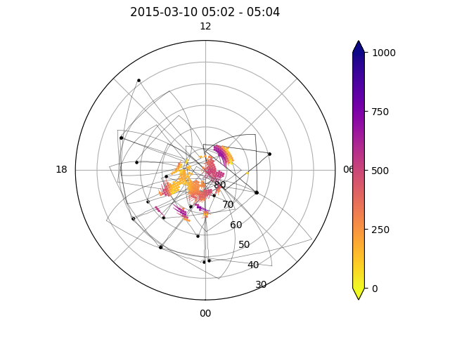
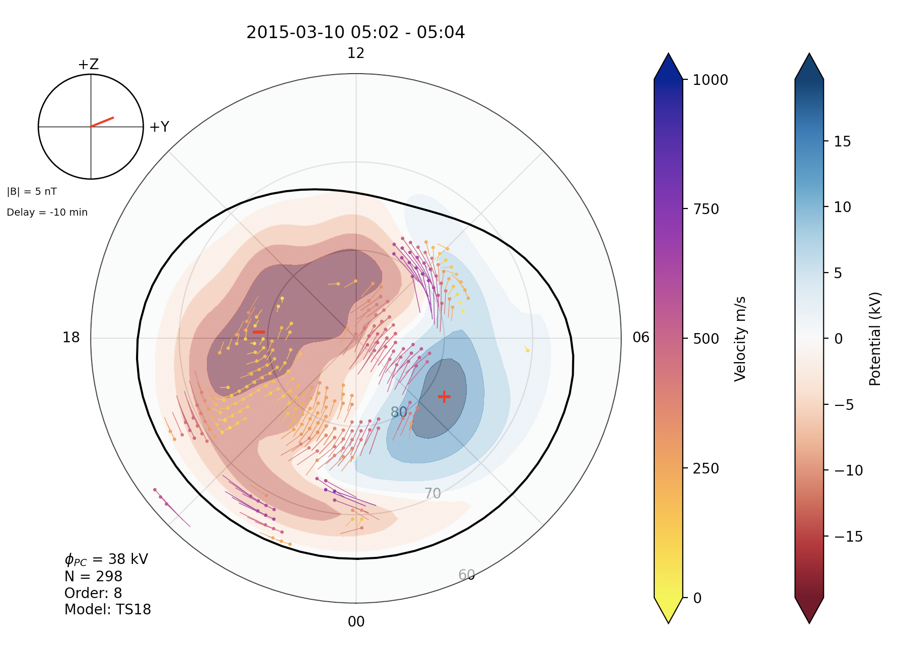

<!--Copyright (C) 2021 SuperDARN Canada, University of Saskatchewan 
Author(s): Marina Schmidt 
Modifications:

Disclaimer:
pyDARN is under the LGPL v3 license found in the root directory LICENSE.md 
Everyone is permitted to copy and distribute verbatim copies of this license 
document, but changing it is not allowed.

This version of the GNU Lesser General Public License incorporates the terms
and conditions of version 3 of the GNU General Public License, supplemented by
the additional permissions listed below.
-->

# Map plots
---

Map plots are a way to visualise data from a MAP file of a SuperDARN radars. Please read RST documentation on how to process [MAP files](https://radar-software-toolkit-rst.readthedocs.io/en/latest/user_guide/map_grid/) from GRID files.    

[Map field descriptions can be found [here](https://radar-software-toolkit-rst.readthedocs.io/en/latest/references/general/map/). pyDARN uses a `enum` object to select different common parameters to plot in a MAP file:

| Name               | parameter name                | Map field name                |
| ------------------ | ----------------------------- | ----------------------------- |
| Fitted Velocity    | `MapParams.FITTED_VELOCITIES` | see Fitted Velocities section |
| Modeled Velocities | `MapParams.MODEL_VELOCITIES`  | `model.vel.median`            |
| Raw Velocities     | `MapParams.RAW_VELOCITIES`    | `vector.vel.median`           |
| Power              | `MapParams.POWER`             | `vector.pwr.median`           |
| Spectral Width     | `MapParams.SPECTRAL_WIDTH`    | `vector.wdt.median`           |

for a given `start_time` or `record` number projected onto a polar format plot in [AACGMv2](http://superdarn.thayer.dartmouth.edu/aacgm.html) coordinates. 

Currently, map plots in pyDARN get geomagnetic positions of the mapped data in [`mlon` and `mlat`](https://pypi.org/project/aacgmv2/) from the MAP file, which uses AACGMv2 coordinates. In the future, pyDARN will also generate the geographic position of the data points, which will bring support for non-standard gridded vector layouts.

## Fitted Velocities

Fitted velocities are the convection map generated by Legendre polynomial, the fitted order and coefficients.
Constrained by the line-of-sight vectors (LOS) but not determined by the LOS vectors. 
<!-- Need to fill-in more -->

## Modeled Velocities 


### Basic usage

pyDARN and pyplot need to be imported and the desired MAP file needs to be [read in](https://pydarn.readthedocs.io/en/master/user/SDarnRead/):

```python
import matplotlib.pyplot as plt
import pydarn

#Read in Map file using SuperDARNRead, then read_map
file = "path/to/grid/file"
SDarn_read = pydarn.SuperDARNRead(file)
map_data = SDarn_read.read_map()

```
With the map data loaded as a list of dictionaries (`map_data` variable in above example), you may now call the `plot_mapdata` method. Make sure you tell the method what time, in [`datetime` format], or record number (numbered from first recorded in file, counting from 0):
```python
import datetime as dt

mapplot = pydarn.Map.plot_mapdata(map_data, record=150)
plt.show()

```
In this example, the record at 150 was plotted with the defaulted parameter, `MapParams.FITTED_VELOCITIES` (fitted velocities), being mapped:


You might have noticed that the variable `mapplot` in the examples above actually holds some information. This contains the AACGM latitude and longitude of the mapped vectors plotted. If you instead change `mapplot` to 3 separate variables, it will return the latitude, longitude, and data info into separate variables:
```python
lats,lons,data=pydarn.Map.plot_mapdata(map_data, start_time=stime)
```

### Additional options

Here is a list of all the current options than can be used with `plot_mapdata`

| Option                         | Action                                                                                |
| ------------------------------ | ------------------------------------------------------------------------------------- |
| record=(int)                   | Record number to plot                                                                 |
| start_time=(datetime.datetime) | The start time of the record to plot                                                  |
| time_delta=(int)               | How close to the start time to be to the start time of the record                     |
| lowlat=(int)                   | Control the lower latitude boundary of the plot (default 30/-30 AACGM lat)            |
| boundary=(bool)                     | Boolean to show the Field-of-View of the radar(s)                                |
| cmap=matplotlib.cm             | A matplotlib color map object. Will override the pyDARN defaults for chosen parameter |
| zmin=(int)                     | Minimum data value for colouring                                                      |
| zmax=(int)                     | Maximum data value for colouring                                                      |
| colorbar=(bool)                | Set true to plot a colorbar (default: True)                                           |
| colorbar_label=(string)        | Label for the colour bar (requires colorbar to be true)                               |
| title=(str)                    | To add a title to the plot                                                            |
| radar_label=(str)        | To include a dot at radar location and label of 3 letter code |
| fov_color=(str)           | Fill color of fov                                                         |
| line_color=(str)      | Fill color of fov lines                                                                          |


As an example, the following code plots multiple radar Grid plot:
```python
import matplotlib.pyplot as plt 
import datetime as dt
import pydarn

map_file = "20150310.n.map"
map_data = pydarn.SuperDARNRead().read_dmap(map_file)

stime = dt.datetime(2015, 3, 10, 22, 58) 
pydarn.Maps.plot_mapdata(map_data, parameter=pydarn.MapParams.RAW_VELOCITY,
                         start_time=stime, lowlat=60,
                         colorbar_label='velocity m/s')

plt.show()
```

