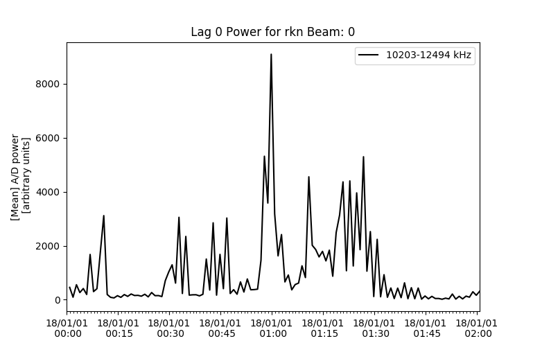
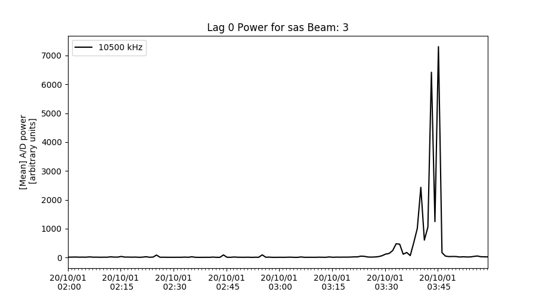
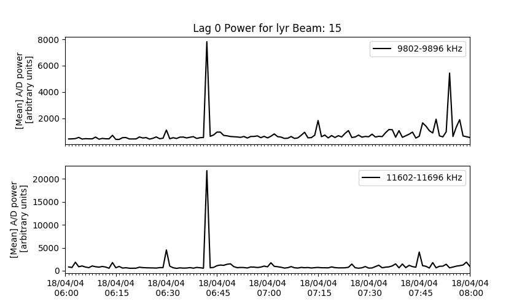

<!--Copyright (C) SuerDARN Canada, University of Saskatchewan 
Author(s): Marina Schmidt 
Modifications:

Disclaimer:
pyDARN is under the LGPL v3 license found in the root directory LICENSE.md 
Everyone is permitted to copy and distribute verbatim copies of this license 
document, but changing it is not allowed.

This version of the GNU Lesser General Public License incorporates the terms
and conditions of version 3 of the GNU General Public License, supplemented by
the additional permissions listed below.
-->


### Statistical Power Plots

This function will calculate and plot a statistic of the lag-0 power of each record as a function of time.

This function applies the statistical function (ex. numpy.mean) to the pwr0 vector (lag-0 power for each range) for each record
before plotting the results from all records chronologically.

This code can be used to study background interference in rawacf data
when the radar has been operating in a receive-only mode such as
"politescan" (cpid -3380), or during periods without any obvious
coherent scatter returns from any range.

Basic code to plot lag 0, will plot the mean of `pwr0` for all frequencies at beam 0, from a RAWACF file would look like:
```python
import matplotlib.pyplot as plt
import pydarn

file = "20180101.0000.01.rkn.rawacf"
sdarn_read = pydarn.SuperDARNRead(file)
rawacf_data = sdarn_read.read_rawacf()

pydarn.ACF.plot_acfs(rawacf_data)
plt.show()
```  



You also have access to numerous plotting options:


| Parameter                  | Action                                                   |
| -------------------------- | -------------------------------------------------------- |
| beam_num=0                 | beam number to plot                                      |
| min_frequency              | minimum Frequency (inclusive) to plot                    |
| max_frequency              | maximum Frequency (inclusive) to plot                    |
| split_frequency            | specific frequency to look for or split between          |
| statistical_method=np.mean | the statistical calculation to apply to the `pwr0` array |

If you want display only one frequency set `min_frequency = max_frequency`:  

```python
import pydarn
import matplotlib.pyplot as plt 

rawacf_file = '20201001.0200.00.sas.0.rawacf.hdf5'
rawacf_data = pydarn.SuperDARNRead().read_borealis(rawacf_file)
pydarn.Power.plot_pwr0_statistic(rawacf_data, beam_num=3, min_frequency=10500, max_frequency=10500)
plt.show()
```    


!!! Warning
    If the radar is running non-normal scan mode then the this may produce a blank plot or raise an error of **No Data Found**. 
    Also, **ROS** superDARN radars will vary slightly in a frequency thus causing issues for picking a specific frequency. 


To compare data above and below a specific frequency, you can compare by using the `split_frequency` option:

``` python
import pydarn
import matplotlib.pyplot as plt 

rawacf_file = 'data/20180404.0601.00.lyr.rawacf'
rawacf_data = pydarn.SuperDARNRead(rawacf_file).read_rawacf()
pydarn.Power.plot_pwr0_statistic(rawacf_data, beam_num=15, split_frequency=11000, max_frequency=12000)
plt.show()
```



!!! Note
    Depending on the mode that is being run, type of radar system, and the frequency range you may get this error `plot_exceptions.NoDataFoundError`. Make sure you know the frequency range for your data as there might be data at a different frequency range, the parameters just need to be tweaked a bit.  
