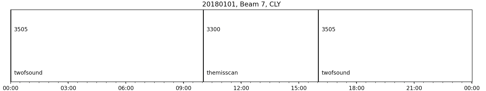

### Time Series Plots

`plot_time_series` simply plots out a time series of any scalar beam parameter in the loaded in FITACF or RAWACF file. Currently there is no functionalilty to plot parameters from MAP files. To do that, you would need to manually extract the information from those loaded dictionaries. See [`pydarnio.SDarnRead`](https://pydarnio.readthedocs.io/en/release-1.0/user/SDarnRead/) for more info.

Basic code to plot a time series from a FITACF file would look like:
```python
import matplotlib.pyplot as plt

import pydarn

file = "20190831.C0.cly.fitacf"
sdarn_read = pydarn.SuperDARNRead(file)
fitacf_data = sdarn_read.read_fitacf()
 
pydarn.RTP.plot_time_series(fitacf_data)
plt.show()
```    
If no scalar parameter is specified (using `parameter=string`), or beam (using `beam_num=int`), then the default is a `tfreq` time series from beam 0. 

In a similar way to RTP, you also have access to numerous plotting options:


| Parameter                    | Action                                                      |
|------------------------------|-------------------------------------------------------------|
| start_time=(datetime object) | Control the start time of the plot                          |
| end_time=(datetime object)   | Control the end time of the plot                            |
| date_fmt=(string)            | How the x-tick labels look. Default is ('%y/%m/%d\n %H:%M') |
| channel=(int or string)      | Choose which channel to plot. Default is 'all'.             |
| cp_name=(bool)               | Print the name of the cpid when plotting cpid timeseries' |


For example, checking out the cpid's for a 24hour Clyde FITACF file:

```python
plt.title("20180101, Beam 7, CLY")
pydarn.RTP.plot_time_series(fitacf_data, parameter='cp', date_fmt=('%H:%M'), beam_no=7)
plt.show()
```    

