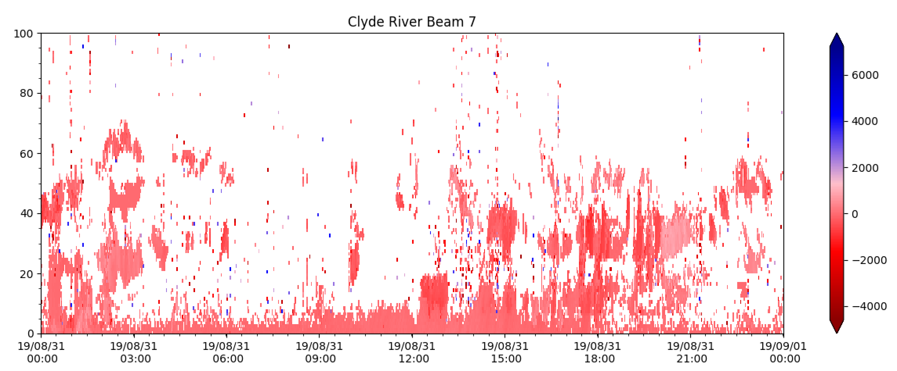
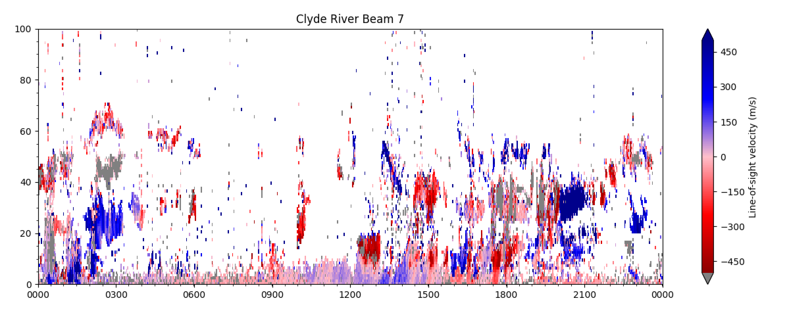
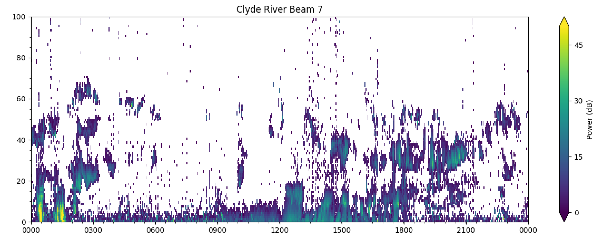

# Range-Time Parameter Plots 
---

Range-time parameter plots (also known as range-time intensity (RTI) plots) plot a radar measured parameter along range gates versus time. They are the most common way to look at data from a single radar. 

!!! Note
    Slant ranges are future enhancement we are currently working on. Sorry for inconvenience.

### Basic RTP
The general syntax for plot_range_time is:
'plot_range_time(fitacf_data, options)'
where 'fitacf_data' is the read in data, and the options are several python parameters used to control how the plot looks.

First, make sure Pydarn and matplotlib are imported, then read in the .fitacf file with the data you wish to plot:
```python
import pydarn
import matplotlib.pyplot as plt

fitacf_file = "path/to/fitacf/file"
sdarn_read = pydarn.SDarnRead(fitacf_file)
fitacf_data = sdarn_read.read_fitacf()

```

You can choose one of four data products to plot:

| Data product                | String name |
|-----------------------------|-------------|
| Line of sight velocity (m/s)| 'v'         |
| Spectral width (m/s)        | 'w_l'       |
| Elevation angle (degrees)   | 'elv'       |
| Power (dB)                  | 'p_l'       |

which is chosen by adding: 
'parameter=String name' 
as an option. The default if left blank is 'v'.

To specify which beam to look at, add the option:
'beam=beam_number"

As an example, taking a look at some 'v' data from the Clyde River radar, beam 7:
```python
fitacf_file = "20190831.C0.cly.fitacf"
sdarn_read = pydarn.SDarnRead(fitacf_file)
fitacf_data = sdarn_read.read_fitacf()

plt.title("Clyde River Beam 7")
pydarn.RTP.plot_range_time(fitacf_data, beam_num=7)              
plt.show()
```
which produces:



Notice that the velocity scale on the right is a bit larger than we need, and also ground scatter isn't shown by default. Below, there are some additional parameters you can set to address these and more.

### Additional options
To see all the customisation options, check out all the parameters listed in 'rtp.py'. A few useful ones:

| Parameter                    | Action                                                      |
|------------------------------|-------------------------------------------------------------|
| start_time=(datetime object) | Control the start time of the plot                          |
| end_time=(datetime object)   | Control the end time of the plot                            |
| groundscatter=(bool)         | True or false to showing ground scatter as grey             |
| date_fmt=(string)            | How the x-tick labels look. Default is ('%y/%m/%d\n %H:%M') |
| zmin=(int)                   | Minimum data value to be plotted                            |
| zmax=(int)                   | Maximum data value to be plotted                            |

For instance, code for a velocity RTP showing the same beam 7 of Clyde river radar as above, but with ground scatter, date format as 'hh:mm', custom min and max values and a colour bar label could look something like:
```python
pydarn.RTP.plot_range_time(fitacf_data, beam_num=7, groundscatter=1, zmax=500, zmin=-500, date_fmt='%H%M', colorbar_label='Line-of-sight velocity (m/s)')
```
which outputs:

 

and looks much more useful!

#### Plotting with a custom color map
Because the default parameter plotted is line-of-sight velocity, there is also a special red-blue colour map set as default (as seen above) which is only meant for velocity RTP's. 

To change the color map, use the 'cmap' parameter with the string name of a matplot lib color map ([found here](https://matplotlib.org/tutorials/colors/colormaps.html)). For example, plotting the power along beam 7 of Clyde using the colormap 'viridis':
```python
pydarn.RTP.plot_range_time(fitacf_data, beam_num=7, parameter='p_l', zmax=50, zmin=0, date_fmt='%H%M', colorbar_label='Power (dB)', cmap='viridis')
```
produces:



Feel free to choose a color map which is palatable for your needs.


