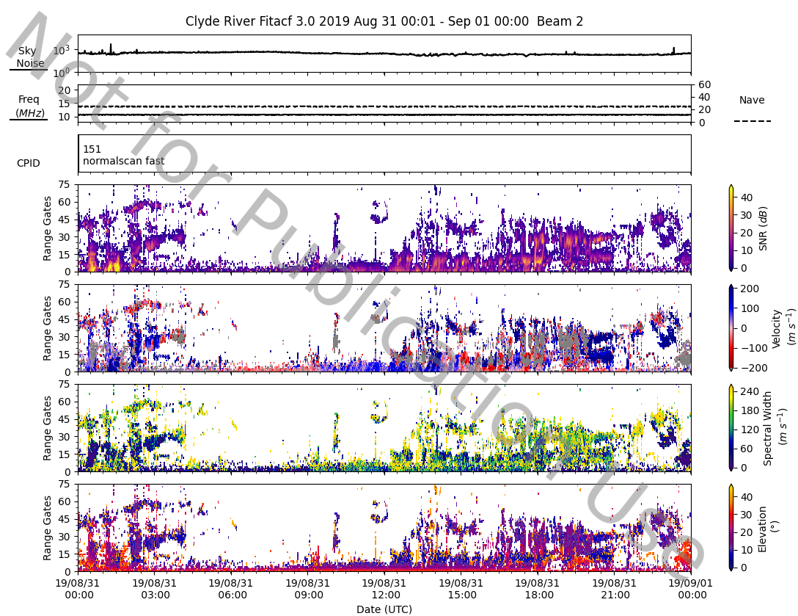
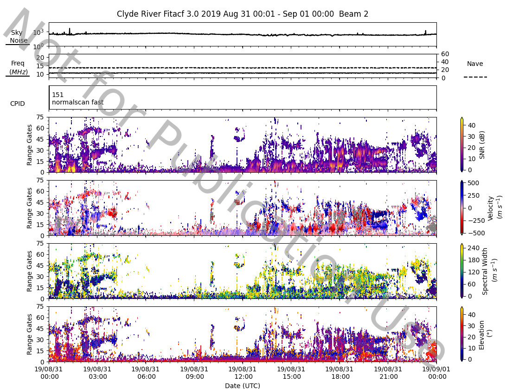

# Summary plots 

Summary plots in SuperDARN are a collection of set parameter plots from a FITACF file. The parameters typically in the plots are:

* Time-series plots:
	* Sky Noise (`noise.sky`)
	* Transmission Frequency and Number of averages (`tfreq` and `nav`)
	* Control Program ID (`cp`)
* Range-time plots:
	* Signal to Noise (`p_l`)
	* Velocity (`v`)
	* Spectral Width (`w_l`)
	* Elevation (`elv`)

!!! Note
    Elevation (`elv`) is optional to plot and is set to be plotted, however, not all radars have elevation data. 
    If the radar doesn't have elevation data then it is not plotted.

## Default Summary
With pyDARN and matplotlib imported, read in a FITACF with `pydarn.SuperDARNRead`, then call `plot_summary` with a chosen beam number. Here, we've loaded in some data from Clyde River and chosen beam 2:
```python
import matplotlib.pyplot as plt

import pydarn

fitacf_file = "20190831.C0.cly.fitacf"
darn_read = pydarn.SuperDARNRead(fitacf_file)
fitacf_data = darn_read.read_fitacf()

pydarn.RTP.plot_summary(fitacf_data,beam_num=2,slant=False)
plt.show()
```
which gives:



Note that ground scatter is displayed as default in the velocity panel. To disable it, you can use the option `groundscatter=false`.

Additionally, in this plot we have set `slant=False` to plot the range-time parameters against range gates. Setting `slant=True` or leaving `slant` undeclared will plot the range-time parameters against slant range on the y-axis. 

### Additional options
In the example above, we can see the velocities are a little too high for the default colour scale. To change that, we need to create a python dictionary that redefines the boundaries:

```python
boundaries={'v': [-500,500]}

pydarn.RTP.plot_summary(fitacf_data,beam_num=2,boundary=boundaries)
plt.show()

```
which gives:



You can change the boundaries on all of the panels by adding more keys to the dictionary. The keys must be named correctly to work, using the strings at the top of this tutorial.

Other common options include:
| Parameter        | Action                                                                   |
|------------------|--------------------------------------------------------------------------|
| channel=(int)    | Specify channel number (default=all)                                     |
| slant=(bool)     | True (y-axis plotted with slant range), False (plotted with range gates) |
| watermark=(bool) | True adds a 'not for publication' watermark                              |
| cmaps=(dict/str) | Specifies the colour maps used in plotting                               | 

For more options on how to modify plot_summary, take a look at the method in `rtp.py`.
