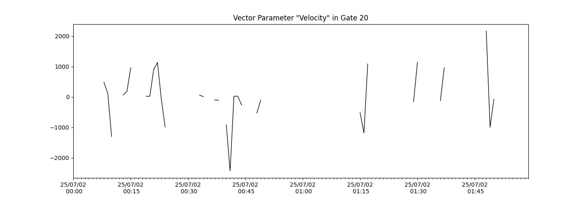

<!--Copyright (C) SuperDARN Canada, University of Saskatchewan 
Author(s): Marina Schmidt 
Modifications:
2020-12-01 Carley Martin updated documentation

Disclaimer:
pyDARN is under the LGPL v3 license found in the root directory LICENSE.md 
Everyone is permitted to copy and distribute verbatim copies of this license 
document, but changing it is not allowed.

This version of the GNU Lesser General Public License incorporates the terms
and conditions of version 3 of the GNU General Public License, supplemented by
the additional permissions listed below.
-->

# Basic Time Series Plots

`plot_time_series` simply plots out a time series of any scalar beam parameter in FITACF or RAWACF files. See [Map](map.md) tutorial for map file scalar parameter plotting.

Basic code to plot a time series from a FITACF file would look like:
```python
import matplotlib.pyplot as plt
import pydarn

file = "20190831.C0.cly.fitacf"
fitacf_data, _ = pydarn.read_fitacf(file)
 
pydarn.RTP.plot_time_series(fitacf_data)
plt.show()
```    
If no scalar parameter is specified (using `parameter=string`), or beam (using `beam_num=int`), then the default is a `tfreq` time series from beam 0. 

In a similar way to RTP, you also have access to numerous plotting options:


| Parameter                    | Action                                                      |
|------------------------------|-------------------------------------------------------------|
| start_time=(datetime object) | Control the start time of the plot                          |
| end_time=(datetime object)   | Control the end time of the plot                            |
| date_fmt=(string)            | How the x-tick labels look. Default is ('%y/%m/%d\n %H:%M') |
| channel=(int or string)      | Choose which channel to plot. Default is 'all'.             |
| cp_name=(bool)               | Print the name of the cpid when plotting cpid timeseries'   |
| color=(str)                  | Color of the line plot                                      |
| linestyle=(str)              | Style of line plotted                                       |
| linewidth=(float)            | Thickness of plotted line                                   |


For example, this plot shows the cpids in a 24hour Clyde FITACF file:

```python
plt.title("20180101, Beam 7, CLY")
pydarn.RTP.plot_time_series(fitacf_data, parameter='cp', date_fmt=('%H:%M'), beam_no=7)
plt.show()
```    


# Advanced Time Series Plots

This method is flexible and can be used to plot any value as a time series. By choosing any parameter that matches a field name in any of the DMap files, you can plot that parameter as a time series. The user can also can choose a vector parameter, and then choose the gate in which you would like to plot the data with time using the gate option (e.g. `gate=25`).

```python
fitacf_data,_ = pydarn.read_fitacf('20250702.0000.00.sas.a.fitacf')
plt.title('Vector Parameter "Velocity" in Gate 20')
pydarn.RTP.plot_time_series(fitacf_data, parameter='v', beam_no=7, gate=20)
plt.show()
```

